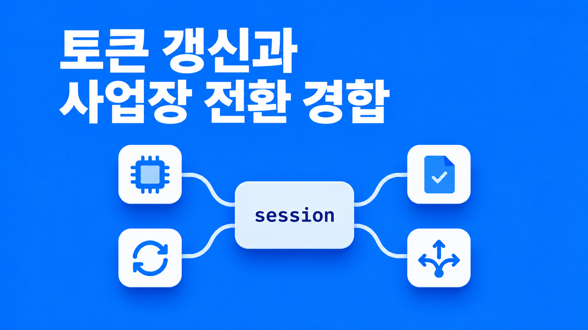

되고세이퍼 모바일 앱은 access token과 refresh token으로 인증했다. 서버는 계정마다 Redis 슬롯 하나로 유효한 토큰을 관리했고, 사용자가 사업장을 바꾸면 새 사업장 정보가 담긴 토큰을 다시 발급했다. 이 구조에서 "앱이 가끔 로그아웃된다"는 문의가 이어졌다.

조사해 보니 가장 큰 원인은 토큰 갱신이 서버 방식과 맞지 않아 성공하지 못한 것이었다. 그런데 갱신만 고치면 그동안 가려져 있던 문제가 이어서 드러날 상황이었다. 동시 갱신 경합, 늦게 도착한 만료 응답, 무한 재시도, 오류 전달 경로에 따라 달라지는 코드 의미, 사업장 전환 중 늦게 도착한 요청, 흩어진 토큰 읽기 지점이었다.

이 글은 그 문제들을 어떻게 정리했는지에 대한 기록이다. 서버 쪽 규칙(계정당 슬롯 하나, 사업장 전환 시 토큰 재발급)은 바꾸지 않고 앱 쪽 설계만 손댔다.

## 서버의 인증 구조: 계정당 Redis 슬롯 하나

먼저 서버 구조를 정리했다. 인증에 쓰는 요소는 세 가지였다.

| 요소          | 내용                                                                         |
| ------------- | ---------------------------------------------------------------------------- |
| access token  | 유효기간이 짧다. 사용자와 현재 사업장 정보가 들어 있다                       |
| refresh token | access token 만료 시 새 access token을 받는 데 쓴다. 유효기간이 훨씬 길다    |
| Redis 슬롯    | 서버가 계정마다 하나씩 두는 저장소. 지금 유효한 access token이 기록된다      |

서버의 `JwtFilter`는 요청마다 다음 순서로 검사했다.

1. access token의 기한이 지났으면 904를 돌려준다.
2. 계정의 Redis 슬롯이 없으면 902를 돌려준다.
3. 슬롯에 기록된 토큰과 요청의 토큰이 다르면 901을 돌려준다.

설계 전체를 좌우한 건 세 번째 검사였다. 슬롯이 하나뿐이라서 새 토큰이 발급되는 순간 이전 토큰은 기한이 남아 있어도 901 대상이 됐다.

access token에 사업장 정보가 들어 있다는 점도 중요했다. 서버는 토큰에 적힌 사업장을 보고 메뉴와 권한을 정했다. 토큰을 바꾸는 일이 곧 사업장을 바꾸는 일이었다.

## 갱신 방식

서버에는 별도의 갱신 엔드포인트가 없었다. 만료된 access token과 refresh token을 `rAuthorization` 헤더에 함께 실어 보내면 `JwtFilter`가 그 자리에서 새 access token을 발급하는 방식이었다. 앱의 갱신 요청을 이 방식에 맞췄다.

그동안은 갱신이 항상 실패해서 그다음 단계로 갈 일이 없었다. 갱신이 성공하기 시작하면 아래 문제가 차례로 드러날 것이 코드에서 보였다.

## 동시 갱신은 공유 Promise 하나로

홈 화면을 열면 위젯 다섯 개가 동시에 요청을 보냈다. access token이 막 만료됐다면 다섯 요청이 동시에 904를 받는다. 규칙이 없으면 다섯 요청이 각자 갱신을 보내고, 서버는 새 토큰을 발급할 때마다 슬롯을 덮어쓴다.

```text
1번 요청이 받은 토큰 → 슬롯에 기록
2번 요청이 받은 토큰 → 슬롯을 덮어씀 (1번 토큰은 이제 901 대상)
...
5번 요청이 받은 토큰 → 최종
```

1번부터 4번 요청은 방금 받은 토큰으로 재시도하다가 901을 받는다. 앱은 901을 "다른 기기에서 로그인했다"로 해석해 로그아웃시킨다. 갱신을 많이 할수록 로그아웃되는 구조였다.

CerberAuth의 글 제목이 이 상황을 그대로 가리켰다. "사용자가 랜덤하게 로그아웃되나요? 토큰 갱신이 자기 자신과 싸우고 있을지도 모릅니다." 해결책은 한 줄이었다.

> "serialize access to the refresh token so only one refresh is ever in flight"

### 대기 큐 대신 공유 Promise를 택했다

갱신을 한 번에 하나만 진행하는 방법은 두 가지였다.

기존 코드는 대기 큐 방식이었다. 첫 요청만 갱신을 보내고, 나머지는 콜백을 큐에 넣고 기다린다. 첫 요청이 새 토큰을 받으면 큐를 돌며 하나씩 깨운다. 문제는 첫 갱신이 실패했을 때였다. 기존 코드는 큐를 비우기만 해서, 대기하던 요청은 실패 통보를 받지 못하고 계속 기다렸다. 화면에서는 로딩 스피너가 끝나지 않았다.

그래서 공유 Promise 방식(single-flight)으로 바꿨다. 첫 요청이 갱신을 시작하면서 진행 중인 Promise 하나를 모듈 변수에 두고, 나머지 요청은 그 Promise를 기다리게 했다. 성공이든 실패든 Promise가 결정되면 모두가 같은 결과를 받으므로 큐를 따로 관리할 필요가 없었다. axios-auth-refresh, Auth0 SDK, WorkOS도 이 방식을 쓰고 있었다.

```ts
let refreshing: Promise<string> | null = null;

function refresh() {
  refreshing ??= doRefresh().finally(() => {
    refreshing = null;
  });
  return refreshing;
}
```

`??=`는 비어 있을 때만 값을 채운다. 첫 호출만 `doRefresh()`를 실행하고 나머지는 같은 Promise를 받는다.

갱신이 확정 실패했을 때 세션을 끊는 판단은 처음에 인터셉터에 두려고 했지만, `doRefresh` 안으로 옮겼다. 인터셉터 밖에서 갱신을 부르는 경로(뒤에 나오는 `withFreshToken`)에서도 같은 판단이 적용돼야 했기 때문이다.

## 늦게 도착한 904와 재시도 제한

### 갱신 전에 보낸 토큰을 비교했다

공유 Promise로 바꿔도 빈틈이 하나 남았다. 6번째 요청이 조금 늦게 904를 받으면, 그때는 이미 갱신이 끝나 공유 Promise가 `null`로 돌아가 있다. 6번 요청은 진행 중인 갱신이 없다고 보고 갱신을 다시 보내고, 서버는 새 토큰을 발급해 슬롯을 덮어쓴다. 1번부터 5번이 받아 둔 토큰은 다시 901 대상이 된다.

그래서 갱신을 보내기 전에 이 요청이 들고 나간 토큰과 지금 메모리의 토큰을 비교하게 했다. 다르면 이미 누군가 갱신을 끝낸 것이므로 메모리의 새 토큰으로 재시도만 한다. 요청마다 보낸 토큰은 `_sentToken`으로 기록했다.

Square의 OkHttp 공식 레시피에도 "이 자격 증명으로 이미 실패했으면 다시 시도하지 마라"는 규칙이 있다. Android 진영에서 오래 써 온 패턴이다.

### 재시도는 한 번만 하게 했다

새 토큰으로 재시도했는데 또 904가 나오는 경우도 있었다. 서버 시계가 틀렸거나 서버가 비정상적으로 짧은 토큰을 준 경우다. 기존 코드는 904가 나올 때마다 다시 갱신을 보내서 끝이 없었다.

재시도 요청의 config에 `_retried` 플래그를 세우고, 플래그가 있는 요청이 또 904를 받으면 더 시도하지 않고 로그아웃으로 정리하게 했다. OkHttp 레시피의 "세 번 실패하면 그만둬라"와 같은 발상이다.

## 응답 판정을 함수 하나로 모았다

### 오류 전달 경로가 두 가지였다

서버가 오류를 알리는 경로는 두 가지였다.

- 필터(`JwtFilter`) 응답은 HTTP status에 904, 901 같은 코드를 실었다.
- 컨트롤러 응답은 HTTP status를 200으로 두고 본문 `status` 필드에 901, 903 같은 코드를 실었다.

axios 인터셉터에는 성공 인터셉터와 오류 인터셉터가 있었다. 성공 인터셉터는 본문을 열어 보고 문제가 있으면 reject했는데, 이 reject는 오류 인터셉터로 가지 않고 호출자에게 바로 갔다. axios가 인터셉터 쌍을 `then(fulfilled, rejected)`로 연결하기 때문이고, 직접 실험해서 확인했다.

```text
axios 응답 → [성공 인터셉터] ─(reject)─▶ 호출자에게 바로 감
             [오류 인터셉터]  ← 여기로는 안 옴
```

그래서 본문에 901이 와도 로그아웃 처리가 일어나지 않고 "오류가 발생했습니다"만 떴다.

### 같은 코드가 경로에 따라 다른 뜻이었다

| 코드 | HTTP status (필터)           | 본문 status (컨트롤러)                           |
| ---- | ---------------------------- | ------------------------------------------------ |
| 903  | 토큰 위조, 로그아웃해야 한다 | 이 사업장에 접근 권한 없음, 로그아웃하면 안 된다 |

"903이면 로그아웃"으로 구현하면 권한 없는 사업장을 누른 사용자까지 로그아웃된다.

그래서 판정을 `classifyAuthResponse` 함수 하나로 모았다. 전달 경로, 코드, 메시지를 넣으면 만료, 교체됨, 세션 종료, 사업장 거부, 일시 오류 중 하나를 돌려준다. 두 인터셉터가 모두 이 함수로 판단하게 했고, 새 코드가 생기면 판정표에 한 줄만 추가하면 되도록 했다. 본문 901·902·911은 세션 무효로, 본문 903은 세션을 유지하는 사업장 거부로 판정했다.

### 일시 오류로는 로그아웃하지 않게 했다

AWS Amplify의 토큰 관리 코드(`TokenOrchestrator`)에는 서비스 장애나 요청 제한 같은 일시 오류로는 토큰을 지우지 말라는 주석이 있다. 토큰을 지워도 되는 에러를 허용 목록으로 고정해 두고, 목록에 없으면 로그아웃하지 않는다.

판정 함수도 이 원칙을 따랐다. 엘리베이터에서 네트워크가 끊겨 갱신에 실패한 건 토큰 문제가 아니다. 서버가 refresh token이 무효라고 명확히 응답했을 때만 로그아웃하게 했다. 안전 점검 앱은 지하나 엘리베이터에서도 쓰이므로 이 구분이 특히 중요했다. CerberAuth도 이 구분을 못 하는 것이 불필요한 로그아웃의 가장 큰 원인이라고 했다.

Dropbox는 장기 토큰을 없애고 4시간짜리 단기 토큰으로 바꾸면서 "만료(401)를 제대로 처리하는 앱은 고칠 게 없다"고 안내했다. 갱신 처리를 튼튼하게 해 두면 서버 정책이 바뀌어도 앱이 영향을 받지 않는다는 뜻이다.

## 사업장 전환 중 늦게 도착한 응답: epoch

A 사업장에서 문서 목록을 스크롤하다가 B 사업장으로 바꾸면, 서버는 A 사업장 토큰을 무효화하고 B 사업장 토큰을 발급해 슬롯을 교체했다. 전환 직전에 목록 화면이 다음 페이지를 A 토큰으로 요청했다면 다음과 같이 된다.

```text
t0  A 토큰으로 다음 페이지 요청 출발
t1  B 사업장으로 전환 요청
t2  서버: 슬롯을 B 토큰으로 교체
t3  t0 요청 도착 → 901
t4  앱: "다른 기기에서 로그인" 판정 → 로그아웃
t5  B 토큰 응답 도착 → 이미 로그아웃된 상태에 저장
```

사용자는 사업장을 바꿨을 뿐인데 중복 로그인 안내와 함께 로그아웃된다. 서약서를 쓰고 사업장에 다시 들어갈 때도 같은 일이 생길 수 있었다. 반대로 t0 요청이 A 토큰으로 성공하면 A 사업장 권한으로 받은 데이터가 B 사업장 화면에 섞일 수 있었다.

### 세대 번호로 옛 응답을 버렸다

요청을 보낼 때마다 현재 epoch(세대 번호)를 요청에 `_epoch`로 기록하게 했다. 사업장 전환, 로그인, 로그아웃이 일어나면 epoch를 하나 올린다.

```text
epoch 7: A 사업장에서 보낸 요청들
      ── 사업장 전환 시작, epoch 8로 ──
epoch 8: B 사업장
```

돌아온 응답의 epoch가 현재 값과 다르면 결과와 상관없이 `CanceledError`로 버리게 했다. 901이 와도 로그아웃하지 않고, 성공 데이터가 와도 화면에 넣지 않는다. `useErrorHandler`는 `axios.isCancel`이면 안내를 띄우지 않게 했다.

가장 신경 쓴 건 epoch를 올리는 시점이었다. B 토큰을 받은 뒤에 올리면 t3의 901이 t5보다 먼저 올 수 있어서 늦다. 그래서 사업장 전환 요청을 보내기 직전에 올리기로 했다. 웹은 이미 `tenant-request-context.ts`의 `revision`으로 같은 방식을 쓰고 있었다.

epoch 하나로 다음 문제가 함께 해결됐다.

- 사업장 전환 중 옛 토큰의 901: 옛 epoch라서 무시된다.
- 계정 X로 로그아웃하고 Y로 로그인했는데 X 시절 요청이 늦게 902를 받아 Y를 로그아웃시키는 경우: 옛 epoch라서 무시된다.
- X 시절에 시작한 갱신이 Y 로그인 뒤에 끝나 X 토큰을 Y 세션에 저장하는 경우: 저장 직전에 epoch를 확인해 막는다.
- 901 세 개가 동시에 와서 alert가 세 번 뜨는 경우: 첫 번째가 epoch를 올리므로 나머지 둘은 옛 epoch가 된다.

WorkOS의 글은 락을 너무 믿지 말라고 한다. 락에도 유효시간이 있어서 한쪽이 잠깐 멈춘 사이 락이 풀리면 둘이 동시에 들어갈 수 있다. 그래서 마지막 방어선은 저장 직전에 버전을 확인하고, 이미 바뀌었으면 쓰지 않는 조건부 쓰기라는 것이다. 저장 직전 epoch 확인이 같은 역할을 했다.

### 세션 API와 호출 순서

토큰과 epoch는 새로 만든 `session` 모듈이 관리하게 했다. 사업장 전환과 로그인·로그아웃은 다음 순서로 동작하도록 바꿨다.

| 동작        | 순서                                                                                                                                  |
| ----------- | ------------------------------------------------------------------------------------------------------------------------------------- |
| 사업장 전환 | `begin()`으로 epoch를 올림 → 전환 PUT → 결과를 epoch와 함께 `selectCompany`로 전달 → 같은 epoch일 때만 저장 → 저장 뒤 `cancelQueries` |
| 로그인      | `signIn` 안에서 `commit(begin(), …)` 한 번에 처리                                                                                     |
| 로그아웃    | `begin()` → `cancelQueries` → `clear()`                                                                                               |

처음 계획은 로그인도 요청 전에 `begin()`을 부르는 것이었는데, `signIn` 안에서 한 번에 처리하는 쪽으로 바꿨다. 로그인 화면에는 경쟁할 세션이 없고, 이전 세션은 로그아웃이나 세션 무효 처리의 `begin()`이 이미 끝냈기 때문이다. 덕분에 로그인 호출처 세 곳(일반 로그인, 2단계 인증, 회원가입 흐름)은 건드리지 않았다.

전환 PUT 자체가 904를 받는 경우도 있었다. 이때는 갱신을 한 번 거친 뒤 재시도하는데, 이 요청은 본문에도 `accessToken`을 싣기 때문에 재시도할 때 본문의 토큰도 새 값으로 바꾸게 했다.

### Frontegg와의 차이

B2B 인증 서비스 Frontegg의 구조는 우리와 거의 같았다. 한 사람이 여러 조직에 속하고 조직마다 역할이 다르며, 조직을 바꾸면 새 토큰을 받는다. Frontegg는 조직을 바꿨다고 이전 토큰이 폐기되지는 않는다고 강조하고, 이전 조직 데이터가 새 조직 화면에 섞이지 않게 캐시를 조심하라고 한다.

우리 서버는 반대로 슬롯이 하나라 전환하는 순간 이전 토큰이 무효가 됐다. 그래서 같은 "늦게 온 옛 토큰" 문제가 데이터 섞임이 아니라 로그아웃으로 나타났다. 문제는 같고 증상만 달랐다.

## 토큰 읽기를 메모리 한 곳으로 모았다

기존 앱은 토큰을 SecureStore에 넣어 두고 필요할 때마다 꺼냈다. SecureStore를 직접 읽는 파일이 일곱 개였다. 요청을 보낼 때, 파일을 다운로드할 때, 서명 이미지를 불러올 때, HTML 속 이미지를 불러올 때 각각 읽었다. 여기에는 문제가 두 가지 있었다.

1. SecureStore 읽기·쓰기는 비동기다. 로그인 중 access token과 refresh token을 쓰는 사이에 누가 읽으면 새 access token과 옛 refresh token이 섞일 수 있었다.
2. 파일 다운로드와 이미지 쪽은 갱신 규칙을 몰랐다. 토큰이 만료되면 그냥 실패했다. 이미지 뷰어는 화면을 처음 열 때 읽은 토큰을 계속 들고 있어서 갱신 뒤에도 옛 토큰을 썼다.

그래서 `session` 모듈이 토큰의 유일한 주인이 되게 했다.

- 앱 시작 시 `session.load()`로 SecureStore에서 한 번 읽어 메모리에 두고, 모든 호출자가 메모리에서 읽게 했다.
- 새 토큰은 메모리와 SecureStore에 함께 반영했다. SecureStore 쓰기는 `persist` 체인 하나로 직렬화해 순서가 섞이지 않게 했다.
- React 컴포넌트는 `useSyncExternalStore(session.subscribe, session.getAccessToken)`로 토큰을 구독하게 했다.
- 파일 다운로드, 서명 이미지, 인증 HTML은 `session.withFreshToken`으로 감쌌다. 904를 받으면 같은 single-flight 갱신을 공유하고 한 번 재시도한다. 네이티브 다운로드 응답은 status를 읽는 방법이 달라서 `withFreshToken(run, statusOf)`처럼 status 추출을 호출하는 쪽에 맡겼다. AppAuth의 `performActionWithFreshTokens`와 같은 발상이다.

규칙이 다시 흐트러지지 않게 ESLint로도 막았다. `STORAGE_KEYS.ACCESS_TOKEN`과 `REFRESH_TOKEN`을 `session.ts`와 테스트 밖에서 쓰면 `no-restricted-syntax` 에러가 나게 했다.

## 검증

인터셉터 테스트는 서버 동작을 흉내 내는 가짜 adapter 기반으로 다시 작성했다. 판정표 15행과 갱신·세대·본문 에러 12케이스를 검사했다.

실기기는 Android에서 로컬 백엔드의 access token 만료 시간을 60초로 줄여 확인했고, 판정은 백엔드 `JwtFilter` 로그로 했다.

| 시나리오                                    | 결과                                                         |
| ------------------------------------------- | ------------------------------------------------------------ |
| 만료 후 화면 이동 (동시 요청 3개)           | 904 3건 → 갱신 1회 → 재시도 3건 정상                         |
| 만료 상태에서 사업장 전환                   | 전환 PUT 904 → 갱신 1회 → 본문 토큰 교체 후 재시도 성공      |
| 로그아웃 후 다른 계정으로 바로 로그인       | 새 계정 요청 모두 새 토큰으로 정상, 이전 계정 권한 섞임 없음 |
| 모바일 Redis 슬롯 삭제                      | 902 3건 → 로그인 화면 이동 1회                               |
| 네트워크 끊김 상태에서 만료                 | 네트워크 오류 안내만 표시, 로그아웃 없음. 복구 후 갱신 1회   |
| 다른 백엔드 토큰으로 앱 실행 (901 동시 4건) | 중복 로그인 alert 1회                                        |

## 택하지 않은 방식

| 방식                                     | 택하지 않은 이유                                                                                                                             |
| ---------------------------------------- | -------------------------------------------------------------------------------------------------------------------------------------------- |
| 갱신 경로만 고치기                       | 고치는 순간 동시 갱신 경합, 무한 재시도, 전환 중 901이 드러날 상황이었다. 경로 수정은 출발점일 뿐이었다                                      |
| 대기 큐 방식                             | 첫 갱신이 실패하면 큐를 비우기만 해서 대기 요청이 통보를 받지 못했다. 공유 Promise는 실패도 함께 전달한다                                    |
| 코드 번호만 보고 로그아웃 판정           | 903은 HTTP status로 오면 토큰 위조, 본문으로 오면 사업장 접근 거부였다. 전달 경로를 빼면 권한 없는 사용자까지 로그아웃된다                  |
| 호출하는 곳마다 SecureStore 직접 읽기    | 비동기 읽기 중 토큰 쌍이 섞이고, 파일·이미지 쪽은 갱신 규칙을 몰랐다                                                                         |
| B 토큰을 받은 뒤 epoch 올리기            | 옛 토큰의 901이 새 토큰 응답보다 먼저 올 수 있었다. 전환 요청 직전에 올려야 막혔다                                                           |
| 프로세스 간 파일 락 (iO 방식)            | iO는 iOS 홈 화면 위젯이 앱과 다른 프로세스에서 따로 갱신해 파일 락을 썼다. 우리 앱에는 별도 프로세스가 없어 메모리 single-flight로 충분했다 |
| 로그아웃 시 서버 `/auth/v1/signout` 호출 | 서버의 `signOut`은 웹 Redis 슬롯만 지웠다. 모바일이 호출하면 같은 계정의 웹 세션이 끊겼다                                                     |

## 정리: 규칙 네 개

작업을 마치고 나니 결국 규칙 네 개로 정리됐다.

1. **읽기는 메모리에서 한다.** 토큰은 `session` 모듈 한 곳에 두고 모든 호출자가 거기서 읽는다.
2. **쓰기는 epoch를 확인한 뒤에 한다.** 결과를 저장하기 직전에 아직 같은 세대인지 확인한다.
3. **갱신은 한 번에 하나만 한다.** 진행 중인 Promise 하나를 모두가 기다리고, 늦게 온 요청은 토큰을 비교하고, 재시도는 한 번만 한다.
4. **판정은 함수 한 곳에서 한다.** 전달 경로, 코드, 메시지로 판단해서 같은 코드가 다른 뜻을 갖는 문제를 막는다.

국내 기술 블로그에서는 이 주제를 다룬 글을 찾지 못했지만, 국내 팀들의 GitHub 이슈에는 같은 제목이 반복해서 나왔다. "토큰 갱신 실패 시 대기 요청이 종료되지 않는 문제", "로그아웃 중 진행 중인 토큰 갱신이 세션을 되살리는 문제" 같은 것들이다. 다들 한 번씩 겪는 문제라서, 개별 증상을 하나씩 고치는 대신 위 네 규칙으로 막는 쪽을 택했다.

---

## 참고 자료

- [CerberAuth: Refresh Token Rotation Might Be Fighting Itself](https://www.cerberauth.com/blog/refresh-token-rotation-integration-challenges/)
- [WorkOS: OAuth token refresh has a race condition](https://workos.com/blog/oauth-refresh-token-race-condition)
- [Square: OkHttp Recipes, Handling authentication](https://github.com/square/okhttp/blob/master/docs/recipes.md)
- [AWS Amplify: TokenOrchestrator](https://github.com/aws-amplify/amplify-js/blob/main/packages/auth/src/providers/cognito/tokenProvider/TokenOrchestrator.ts)
- [Auth0: Auth0.swift CredentialsManager](https://github.com/auth0/Auth0.swift/blob/master/Auth0/CredentialsManager.swift)
- [axios-auth-refresh](https://github.com/Flyrell/axios-auth-refresh)
- [andreyka26: Handling refresh token for multiple requests](https://andreyka26.com/handling-refreshing-token-on-multiple-requests-using-react)
- [AppAuth: AuthState](https://openid.github.io/AppAuth-Android/docs/latest/net/openid/appauth/AuthState.html)
- [iO: Fixing OAuth Race Conditions in iOS Apps with Extensions](https://techhub.iodigital.com/articles/fixing-oauth-race-conditions-ios-mobile-app)
- [Frontegg: SaaS Multitenancy](https://frontegg.com/blog/saas-multitenancy)
- [Dropbox: Migrating App Permissions and Access Tokens](https://dropbox.tech/developers/migrating-app-permissions-and-access-tokens)
- [TanStack Query: Query Cancellation](https://tanstack.com/query/v5/docs/framework/react/guides/query-cancellation)
- [UMC-DISPLAYU #365: 토큰 갱신 실패 시 대기 요청이 종료되지 않는 문제](https://github.com/UMC-DISPLAYU/Frontend/issues/365)
- [Washer-App-v2 #279: 로그아웃 중 진행 중인 토큰 갱신이 세션을 되살림](https://github.com/team-washer/Washer-App-v2/issues/279)
