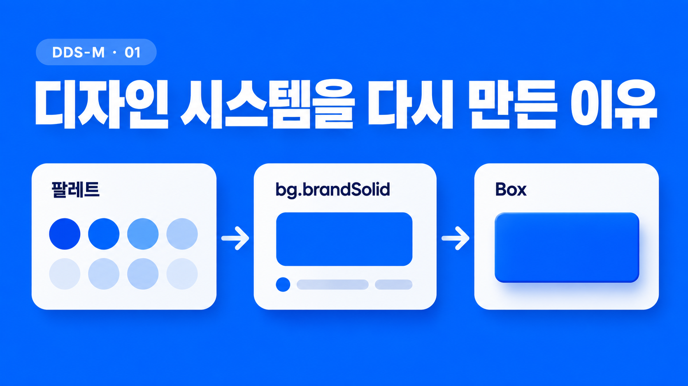
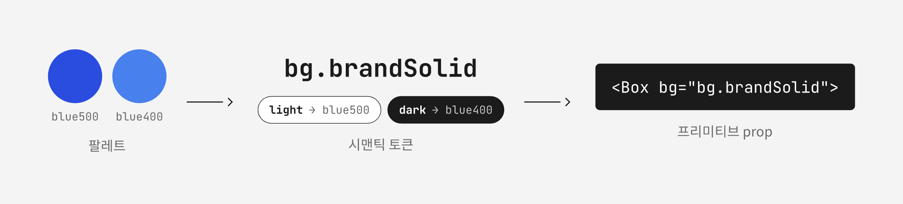
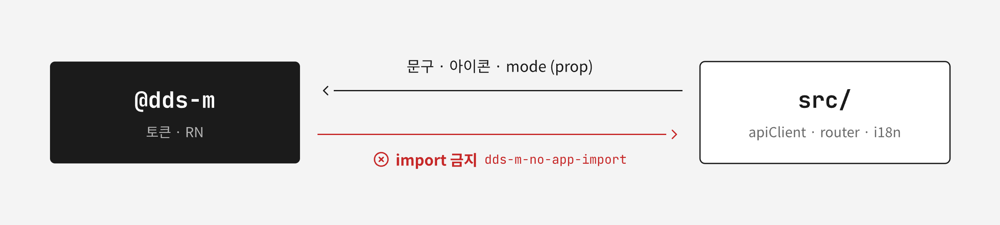

되고세이퍼 모바일 앱의 UI는 전부 `@dds-m`(`packages/dds-m`) 하나로 그린다. 색·간격·라운드·그림자·타이포는 토큰 이름으로 쓰고, 레이아웃은 `Box`·`HStack`·`VStack` 같은 프리미티브의 prop으로 조립한다. 앱 화면 259개 파일이 `@dds-m` 배럴을 import한다.

2026년 7월 이전에는 `@dds-m/ui`(`packages/ui`)와 `@dds-m/tokens`(`packages/tokens`)라는 다른 디자인 시스템이 있었다. 우리는 그 위에 규칙을 덧붙이지 않고 새 패키지를 처음부터 다시 만들었다. 7월 10일 파운데이션 커밋으로 시작해 7월 15일 레거시를 삭제했다.

이 글은 왜 다시 만들었는지, 토큰과 style-props를 어떤 문법으로 묶었는지, 패키지가 왜 앱 코드를 모르게 설계됐는지를 다룬다. 이 규칙이 화면 코드에서 실제로 얼마나 지켜졌고 lint와 AI 에이전트 hook으로 어떻게 강제했는지는 [2부](/posts/dds-m-rules-lint-agents)에서 다룬다. 컴포넌트별 사용법은 다루지 않는다.

## 레거시 평면 토큰에는 역할 규칙을 얹을 수 없었다

레거시 토큰은 평면 이름이었다. `ColorTokens`에 `textPrimary`, `surfaceDefault`, `actionPrimary`, `badge*`, `homeQr*`처럼 60여 개 키가 나란히 있었다. 간격은 `spacing[4]`로 꺼냈고, 스타일은 `createThemedStyles`로 `StyleSheet`를 만들었다.

우리가 지키고 싶었던 규칙은 당근 [SEED](https://seed-design.io/updates/how-seed-evolved)를 참고했다. 색은 역할(`fg.*`/`bg.*`/`stroke.*`)로 고르고, 간격은 `x` 스케일, 라운드는 `r` 스케일, 텍스트는 `textStyle` 레시피로만 지정한다. 맞는 토큰이 없으면 임의 값을 쓰지 않고 멈춘다.

이 규칙은 토큰 이름과 프리미티브 API가 같은 문법을 따를 때만 강제할 수 있다. `textPrimary`에 별칭을 붙이거나 `createThemedStyles` 안에서 새 이름을 쓰게 해도 같은 화면에 옛 문법이 계속 남는다.

당시 앱은 `@dds-m/ui`를 277개 파일에서 import했다. 기존 패키지 이름을 바꾸고 합치는 계획도 검토했다. 하지만 그 277건은 어차피 새 문법으로 다시 써야 할 import였다. 리네임에 드는 작업이 그대로 버려지므로 합치기를 기각하고 새로 만들었다.

## 토큰은 팔레트와 시맨틱 두 계층으로 나눴다

팔레트(`palette.ts`)는 `#2A4CDF` 같은 raw 색에 이름만 붙인 재료다. 시맨틱 색(`semantic.ts`)은 팔레트를 쓰임에 연결한다. 컴포넌트와 화면은 시맨틱 색만 쓴다.

시맨틱 이름은 `{property}.{role}{VariantOrState}` 문법을 따른다.

| 부분     | 값                                                                | 예                     |
| -------- | ----------------------------------------------------------------- | ---------------------- |
| property | `fg`(텍스트·아이콘), `bg`(면), `stroke`(선)                       | `fg.neutral`           |
| role     | `neutral`, `brand`, `critical`, `positive`, `warning`, `layer` 등 | `bg.layerDefault`      |
| variant  | `Solid`, `Weak`, `Muted`, `Subtle`, `Strong`                      | `fg.neutralMuted`      |
| state    | 필요한 역할에만 `Pressed`                                         | `bg.brandSolidPressed` |



light/dark는 시맨틱 계층에서만 갈리게 했다. fg/bg/stroke와 그림자는 모드별로 매핑하고, 간격·라운드·타이포·모션은 두 모드가 같은 값을 쓴다. 그래서 화면 코드는 `bg.layerDefault`라는 이름 하나만 알면 된다. 모드 전환은 앱 루트의 `DdsProvider mode={mode}`가 맡고, `mode`는 `useColorScheme()`에서 온다.

토큰 값은 레거시 팔레트와 수치를 그대로 매핑했다. 재설계는 문법을 바꾼 작업이었고 시각 리디자인이 아니었다. `spacing {1:4 … 12:48}`은 같은 4px 그리드라 `x1`부터 `x12`로 기계적으로 옮겼다. `textPrimary`는 `fg.neutral`로, `actionPrimary`는 `bg.brandSolid`로 옮겼다.

## style-props로 토큰 이름을 prop에 실었다

프리미티브는 토큰 이름을 prop으로 받는다.

```tsx
<VStack bg="bg.layerDefault" gap="x4" p="x6">
  <Text textStyle="title2">결재 문서</Text>
  <Text color="fg.neutralMuted" textStyle="bodySm">
    내용을 확인하고 다음 단계로 이동해요.
  </Text>
</VStack>
```

`components/style-props.ts`의 resolver가 이 prop을 RN 스타일로 바꾼다. `splitStyleProps`가 스타일 prop과 나머지 prop을 나누고, `resolveColor`·`resolveLength`·`resolveRadius`가 현재 theme에서 값을 꺼낸다.

prop 타입은 토큰 이름을 자동완성으로 보여 준다. `padding`·`margin`·`gap`은 `DimensionToken`(`x0` 포함)만 받아서 `p={16}`은 타입 오류다. 크기·위치·`flex` 같은 구조값은 숫자가 필요해서 숫자도 받는다.

`packages/dds-m/src`에는 `StyleSheet.create`가 한 건도 없다.

## 토큰 이름의 원본은 하나, 어긋나면 테스트가 실패한다

토큰 이름의 원본은 `foundation/tokens.ts`의 `const` 배열이다. `fgRoles`, `bgRoles` 같은 배열에서 타입을 만들고, `semantic.ts`의 light/dark 객체가 그 이름을 전부 채운다.

`__tests__/foundation.test.ts`의 drift guard가 두 쪽을 대조한다. 이름 배열에 토큰을 추가하고 dark 값을 빠뜨리거나, 시맨틱 객체에만 키를 추가하면 테스트가 실패한다. 같은 파일에서 타이포 수치와 레거시 그림자 값이 바뀌지 않았는지도 확인한다.

문서 쪽 값은 손으로 쓰지 않았다. `npm run gen:tokens`(`scripts/generate-tokens.mjs`)가 `src/foundation/`에서 세 가지 산출물을 만든다.

```text
src/foundation/*.ts
  └─ npm run gen:tokens
       ├─ docs/foundation/design-token-reference.md   전 토큰 값 사전
       ├─ docs/showcase/tokens.generated.css           쇼케이스 CSS 변수
       └─ docs/showcase/tokens.generated.js            쇼케이스 섹션 데이터
```

코드와 문서가 다르면 `src/foundation/`이 맞다. 토큰과 컴포넌트를 눈으로 확인할 때는 `docs/showcase/index.html`을 브라우저에서 연다.

## 패키지는 앱 코드를 모르게 만들었다

되고시스템은 되고세이퍼를 기반으로 고객사 구축형 시스템을 계속 만든다. 지금까지 구축형 모바일 앱과 웹뷰 프론트는 공유하는 기반 없이 따로 만들어졌다. 프로젝트마다 같은 화면과 규칙을 다시 만드느라 개발 속도가 나지 않았다.

dds-m은 그 구축형 프로젝트들이 가져다 쓰는 것을 전제로 했고, 이 프로젝트가 끝나면 별도 npm 패키지로 분리한다. 구축형 프로젝트는 패키지를 그대로 쓰기도 하고, 포크하거나 파일을 복사해 고쳐 쓰기도 한다. 어느 방식이든 패키지 안에 이 레포에서만 도는 코드가 있으면 가져갈 수 없다.

그래서 `.dependency-cruiser.js`의 `dds-m-no-app-import` 규칙으로 `packages/dds-m/`에서 `src/`로 향하는 import를 error로 막았다. `@shared`, `@entities`, `apiClient`, router가 모두 여기에 걸린다.

i18n도 패키지에 넣지 않았다. 레거시 `packages/ui`는 2026년 5월에 `UiI18nProvider`와 `useUiText`를 내장하고 컴포넌트 25개의 문자열을 `uiText()` 호출로 바꿨다. 그러자 패키지가 앱의 `react-i18next` 네임스페이스(`ui.*`)를 전제하게 됐다. dds-m은 버튼 라벨, 접근성 라벨, 빈 상태 문구를 전부 prop으로 받고, 기본값으로 한국어 리터럴만 둔다.

같은 이유로 외부 상태와 에셋도 주입받는다.

| 필요        | dds-m이 받는 방식                                   |
| ----------- | --------------------------------------------------- |
| 테마 모드   | `DdsProvider`의 `mode` prop                         |
| 아이콘      | 앱이 아이콘을 넘기고 `Icon`은 크기·색·접근성만 적용 |
| 사용자 문구 | 컴포넌트 prop                                       |
| 피드백 큐   | 앱의 `@shared/feedback`(`ui.toast`·`ui.alert`)      |



도메인을 아는 컴포넌트는 `src/shared/ui/`에 뒀다. `WorkerPicker`, `FilePicker`, `DocumentFormLayout`이 그 예다. 이 컴포넌트들은 apiClient와 DTO를 쓰고, 그리기는 dds-m 컴포넌트로 한다. `Document*`, `Approval*` 같은 이름이 dds-m에 들어가면 경계가 깨진 것이다.

## 판단이 필요한 규칙은 AGENTS.md 표에 뒀다

`packages/dds-m/AGENTS.md`는 사람과 AI 에이전트가 UI 작업 전에 읽는 규칙 문서다. 세 가지 표가 화면 작업의 선택을 정한다.

1. 구현 우선순위: 공용 컴포넌트를 먼저 찾고, 없으면 프리미티브와 토큰으로 조합하고, 그래도 표현할 수 없으면 멈추고 토큰이나 컴포넌트 추가를 제안한다.
2. 컴포넌트 트리거 색인: 컴포넌트마다 쓰는 상황과 피할 상황을 한 줄씩 적었다. 예를 들어 `ChipSelect`는 enum·code 상수 옵션에 쓰고, API 목록·검색·페이징이 필요하면 `SinglePicker`를 쓴다.
3. 오버레이·피드백 선택 표와 로딩·빈·에러 상태 표

규칙을 문서로 둔 이유는 lint와 타입이 막지 못하는 판단이 많아서였다. "이 선택지는 Chip인가 Picker인가", "이 색은 `fg.neutralMuted`인가 새 역할인가"는 정적 검사로 판정할 수 없다. 표를 먼저 읽으면 같은 상황에서 같은 컴포넌트를 고르게 된다.

## 레거시를 동결하고 화면 단위로 옮겼다

레거시는 이름·위치·코드를 그대로 두고 버그 수정만 허용했다. dds-m과 레거시는 서로 import하지 않게 했고, 한 화면에 두 시스템이 섞이는 것은 허용했다. 진행 지표는 `grep -rl "@dds-m/ui" src | wc -l`이었고 시작점은 277이었다.

alias를 추가할 때 함정이 하나 있었다. babel `module-resolver`는 prefix 매칭이라 `'@dds-m'` 문자열 alias가 `@dds-m/ui`까지 가로챈다. 그래서 babel과 jest에는 정규식 `'^@dds-m$'`로 exact match를 걸었다. tsconfig paths는 exact 매칭이라 문제가 없었다.

옮기는 순서는 다음과 같았다.

1. 파운데이션과 프리미티브
2. 인터랙티브 컴포넌트와 파일럿 화면
3. 화면별 이전: 홈, 문서 목록, 결재서명, 내정보, 문서 상세, 문서 폼, 인증 화면
4. 피드백 오버레이(`AlertDialog`, `Toast`)
5. 레거시 패키지와 alias 삭제

BottomSheet처럼 레거시에 플랫폼 노하우가 쌓인 컴포짓은 코드를 참고하되 새 토큰과 프리미티브 위에 다시 세웠다. 레거시에서 Android 시트를 순수 RN `Modal`로 다시 쓴 구현이 그런 노하우였다.

## 택하지 않은 방식

| 방식                                     | 택하지 않은 이유                                                                                           |
| ---------------------------------------- | ---------------------------------------------------------------------------------------------------------- |
| 레거시 패키지를 리네임해 합치기          | 토큰 문법과 사용 방식이 달라 새 규칙을 얹을 수 없고, 277건 import 리네임은 어차피 다시 쓸 작업이었다       |
| 외부 UI 킷                               | 토큰 이름과 UX 라이팅 규칙까지 사내 기준으로 강제해야 했다                                                 |
| `createThemedStyles` + `StyleSheet` 유지 | 레거시 사용 방식이라 역할 기반 토큰과 `textStyle` 강제를 얹을 수 없었다                                    |
| 코드모드로 일괄 변환                     | 레거시 이름과 새 역할이 1:1로 대응하지 않았다. 도메인 토큰(`badge*`, `homeQr*`)은 토큰별로 판단이 필요했다 |
| npm workspace와 빌드 단계                | 레거시와 같은 소스 직접 참조(alias)를 유지했다. 분리 배포 전까지는 빌드 단계를 두지 않았다                 |
| 배럴 금지                                | 앱이 `@dds-m` 하나만 import하면 deep import 금지와 공개 API가 같은 경계가 된다                             |
| 패키지에 i18n 내장                       | 레거시에서 패키지가 앱의 번역 네임스페이스를 전제하게 됐고, 분리 배포를 막는다                             |

## 규칙은 토큰 이름에 실린다

dds-m의 규칙은 대부분 이름에 실려 있다. `fg.neutralMuted`, `x4`, `textStyle="bodySm"`처럼 토큰 이름이 곧 선택의 기록이다. 맞는 이름이 없을 때 숫자나 hex를 쓰지 않고 이름을 새로 정하는 것이 이 시스템을 유지하는 방법이었다. 토큰을 추가할 때는 `tokens.ts` 이름, light/dark 값, `gen:tokens` 산출물을 한 번에 바꾼다.

다만 이름으로 지키는 규칙은 이름을 쓰는 자리가 정해져 있을 때만 유지된다. 프리미티브 밖에서 이 규칙이 어떻게 샜는지는 [2부](/posts/dds-m-rules-lint-agents)에서 다룬다.
