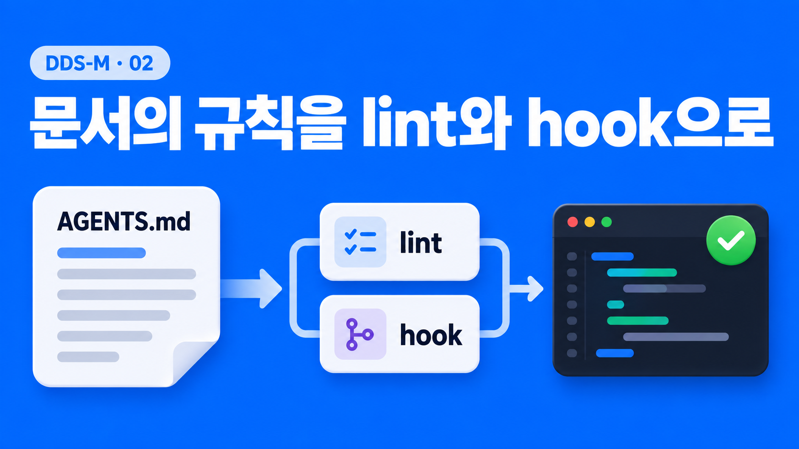
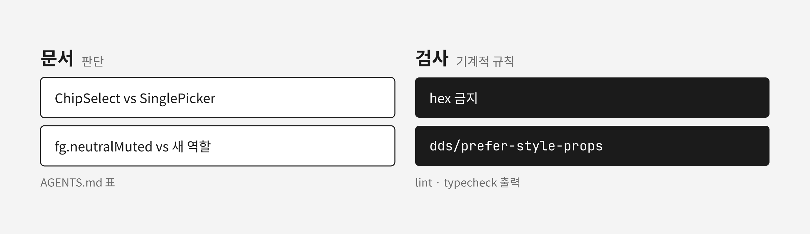
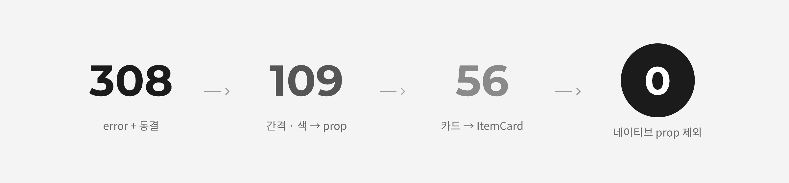
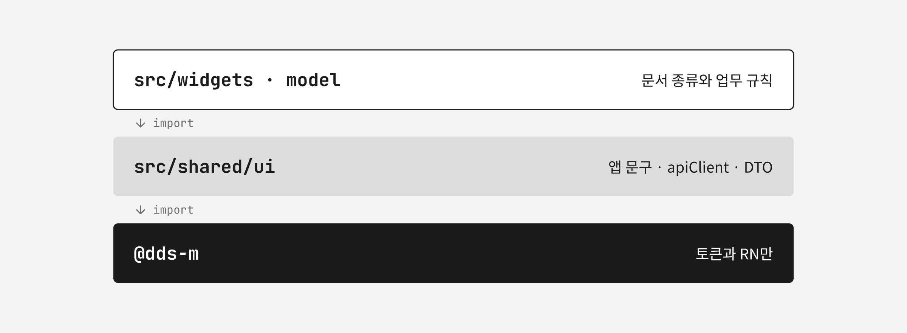
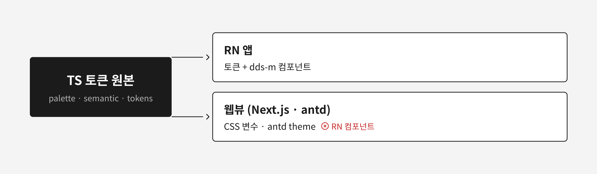

[1부](/posts/dds-m-token-grammar-package-boundary)에서 되고세이퍼 모바일 앱의 디자인 시스템 dds-m을 설명했다. 색은 `fg.*`/`bg.*`/`stroke.*` 역할 토큰으로, 간격은 `x` 스케일로 쓰고, 레이아웃은 `Box`·`VStack` 같은 프리미티브의 prop으로 조립한다. 판단이 필요한 규칙은 `packages/dds-m/AGENTS.md`의 표에 뒀다.

이 앱의 화면 코드는 상당 부분 AI 에이전트가 쓴다. 2026년 10월 2일, 규칙이 화면 코드에서 실제로 지켜지는지 `src/`를 측정했다. 패키지 안은 깨끗했지만 화면 코드는 그렇지 않았다.

이 글은 측정 결과, 에이전트에게 규칙을 전달하는 경로, lint 규칙과 위반 동결로 308건을 0건까지 줄인 과정, 그리고 같은 시기에 정한 재사용·구축형 프로젝트·웹뷰 연결 방식을 다룬다.

## 규칙은 프리미티브 밖에서 샜다

`packages/dds-m/src/components`에는 raw hex와 숫자 padding이 한 건도 없었다. 화면 코드는 달랐다.

| 항목                                                                        | 측정값                                                                                   |
| --------------------------------------------------------------------------- | ---------------------------------------------------------------------------------------- |
| `useDds().theme`의 `dimension`·`color`·`radius`로 스타일 객체를 만드는 파일 | 65개 파일, 387줄. 그중 37개가 `src/pages/`                                               |
| `function useXxxStyles()`로 스타일 객체를 돌려주는 파일                     | 14개                                                                                     |
| raw hex                                                                     | 7개 파일, 31건                                                                           |
| 숫자 spacing prop(`p={16}`)                                                 | 0건                                                                                      |
| 어디서도 쓰지 않는 시맨틱 토큰                                              | 4개(`shimmerHighlight`, `imageScrim`, `positiveSolidPressed`, `informativeSolidPressed`) |

가장 많은 것은 `theme` 값으로 스타일 객체를 만드는 코드였다. `AssessmentUnitEditor`의 `useStyles()`는 `borderColor: theme.color.stroke.neutral`, `paddingHorizontal: theme.dimension.x.x4`처럼 토큰 값을 쓰지만 프리미티브를 거치지 않는다. 레거시 `createThemedStyles`와 같은 모양이다.

토큰을 쓰므로 색이 틀리지는 않는다. 성능 문제도 아니다. RN 0.86.3의 `StyleSheet.create`는 개발 모드에서 객체를 freeze한 뒤 그대로 돌려주고, React Compiler는 `use*` 훅 안의 계산도 메모한다. [Ignite](https://github.com/infinitered/ignite/blob/master/docs/concept/Styling.md)는 theme 함수로 스타일을 만드는 방식을 공식 권장한다.

문제는 두 가지였다. 같은 카드 모양이 화면마다 따로 정의돼 그 모양이 dds-m에 빠진 컴포넌트인지 알 수 없었다. 그리고 이 코드가 다음 화면을 쓰는 에이전트의 예시가 됐다.

숫자 spacing prop이 0건이라는 것은 프리미티브를 쓰는 곳에서는 규칙이 지켜진다는 뜻이었다. 새는 곳은 프리미티브 밖이었다. "시각값은 토큰만", "`style`은 네이티브 상호운용 탈출구"라는 문서 규칙은 이 경로를 막지 못했다. 레거시 시절 `StyleSheet.create` 금지 lint 규칙은 레거시 삭제 때 함께 지웠고, 대신할 규칙을 두지 않았기 때문이다.

## 에이전트는 읽는 문서와 실패하는 검사를 따른다

에이전트는 작업 전에 `AGENTS.md`를 읽고, 작업 후에 `typecheck`·`lint`·`test` 출력을 읽고 고친다. 에이전트에게 규칙이 전달되는 경로는 이 두 가지다.

두 경로는 성격이 다르다. 문서는 판단을 전달한다. "API 목록이면 `SinglePicker`"처럼 정적 검사로 판정할 수 없는 선택은 문서에만 둘 수 있다. 검사는 기계적 규칙을 전달한다. hex 금지나 spacing 토큰 강제처럼 판정이 기계적인 규칙을 문서에만 두면, 에이전트는 문서를 읽고도 주변 코드의 `useStyles()`를 따라 쓴다. 주변 코드가 문서보다 가까운 예시이기 때문이다.

규칙이 에이전트에게 닿는 경로도 따져 봤다. Claude Code가 자동으로 읽는 파일은 루트 `CLAUDE.md`와 그 안의 `@AGENTS.md`뿐이다. `packages/dds-m/AGENTS.md`는 루트 문서의 "UI 작업 전 읽는다"는 지시를 에이전트가 따를 때만 읽힌다. 화면 파일만 고치는 세션에서는 이 지시를 건너뛰어도 막는 장치가 없었다.

[Claude Code 문서](https://code.claude.com/docs/en/memory)는 일부 경로에만 해당하는 규칙을 `paths`를 지정한 rule 파일로 두고, 반드시 지켜야 하는 규칙은 [hook](https://code.claude.com/docs/en/hooks)으로 결정적으로 실행하라고 권한다. 당근 Kraft도 같은 프롬프트로 한 번은 SEED 토큰을, 다음 번은 hex를 쓰는 문제를 겪었고, 생성 뒤 정적 채점기를 돌리는 구조로 바꿨다.

그래서 두 가지를 뒀다.

| 장치                                                       | 동작                                                                                     |
| ---------------------------------------------------------- | ---------------------------------------------------------------------------------------- |
| path-scoped rule `.claude/rules/dds-m-ui.md`               | `src/**/*.tsx`, `packages/dds-m/**`를 읽을 때 dds-m 규칙과 정답 예시 파일을 불러온다     |
| PostToolUse hook `.claude/hooks/eslint-edited.sh`          | Edit·Write 직후 편집한 `.tsx` 파일만 eslint하고, 실패하면 exit 2로 결과를 에이전트에게 돌려준다 |

`.gitignore`의 `.claude`는 `.claude/*`로 바꾸고 `settings.json`, `rules/`, `hooks/`만 예외로 커밋했다. `packages/dds-m/AGENTS.md`에는 "잘못된 예" 3개를 더했다.

lint 메시지는 고치는 방법을 한 줄로 적었다. 에이전트는 그 메시지만 보고 코드를 고친다. "hex 금지"보다 "시맨틱 토큰(fg/bg/stroke)을 쓰고, 맞는 역할이 없으면 토큰 추가를 제안한다"가 다음 행동을 정한다.

## 새 lint 규칙은 처음부터 error로 켜고 기존 위반은 동결했다

[ESLint bulk suppressions](https://eslint.org/docs/latest/use/suppressions)는 기존 위반을 파일×규칙별 개수로 `eslint-suppressions.json`에 기록한다. 개수가 늘면 다시 실패하고, 고치면 개수를 줄인다. [Notion의 ratchet](https://www.notion.com/blog/how-we-evolved-our-code-notions-ratcheting-system-using-custom-eslint-rules)과 같은 방식이다. 이 기능은 `error` 규칙에만 적용된다. 경고로 시작하면 그동안 새 위반이 막히지 않으므로 처음부터 `error`로 켰다.

ESLint 설정은 옛 eslintrc 형식이어서 flat config(`eslint.config.js`)로 먼저 옮겼다. ESLint v10으로도 올리려 했지만 `eslint-config-expo`가 쓰는 `eslint-plugin-react@7.37.5`가 v10에서 `contextOrFilename.getFilename is not a function`으로 깨져 9.39.4에 남겼다. flat 기본값이 새로 켜는 경고(`import/no-duplicates` 등)는 전환 전 결과와 맞추려고 껐다.

raw hex 31건은 대부분 이유가 있었다. 결재 문서 HTML 템플릿, NFPA 도표의 표준 색, 위험성 매트릭스의 등급 색, `DdsProvider` 바깥에서 그리는 `AppErrorFallback`이 여기에 든다. 이런 파일에는 `eslint-disable`과 사유를 달았다. HTML 템플릿은 hex가 100줄이 넘어 줄 단위가 아니라 파일 단위로 껐다. 그 대가로 이 파일들에는 새 hex가 들어와도 규칙이 막지 못한다. hex 원본인 `palette.ts`와 `app.config.ts`는 설정에서 제외했다.

`theme` 직접 사용은 로컬 규칙 `dds/prefer-style-props`로 잡았다. `src/pages`, `src/widgets`, `src/features`에 켰고, 값이 `theme.dimension|color|radius...` 접근 그 자체인 객체 속성만 잡는다. `insets.bottom + theme...`처럼 계산이 섞인 값과 SVG `fill` 같은 JSX 속성은 대상에서 뺐다. 이 기준으로 잡힌 위반은 43개 파일, 308건이었고 전부 동결했다.

동결한 308건은 모양별로 나눴다.

| 모양                                        | 건수 | 파일 | 처리                                                  |
| ------------------------------------------- | ---- | ---- | ----------------------------------------------------- |
| A 카드·패널(배경+테두리+라운드 [+패딩·gap]) | 71   | 7    | 컴포넌트 API를 사람이 정한다. `ItemCard`로 덮이는지 확인 |
| B 구분선·테두리                             | 22   | 4    | `Box`의 `borderBottomWidth`·`borderColor` prop         |
| C 배경·라운드 단독                          | 32   | 11   | `Box`의 `bg`·`borderRadius` prop                       |
| D `gap` 단독                                | 58   | 25   | `View style={{gap}}` → `VStack gap="x_"`              |
| E 패딩·gap 조합                             | 98   | 27   | `VStack`/`HStack`/`Box`의 `p*`·`gap` prop             |
| F 텍스트 색 단독                            | 12   | 4    | `Text color="fg._"`                                   |
| G `margin` 단독                             | 15   | 8    | 부모 `gap`으로 흡수하거나 `mt`·`mb` prop               |

## 동결 308건을 0건으로 줄였다

B부터 G까지는 기계적으로 옮길 수 있는 모양이라 먼저 옮겼다. 패턴 하나를 끝낼 때마다 `npx eslint . --prune-suppressions`로 동결 개수를 줄였고, 308건이 109건이 됐다. 옮기는 김에 쓰지 않는 스타일도 지웠다. `RegularEvaluationForm` 한 파일에서만 19개가 나왔다.

A 모양(카드)은 `AssessmentUnitEditor`의 작업 카드와 표준 위험 카드를 `ItemCard`로 바꿨다. 점검표 시설 정보 패널처럼 제목+본문 구조가 아니고 테두리 색도 다른 곳은 `ItemCard`를 쓰지 않고 prop으로 옮겼다. 109건이 56건이 됐다. `ItemCard`로 바꾼 카드는 모양이 달라졌다. 헤더가 회색 배경이 되고 테두리가 `stroke.neutral`에서 `stroke.neutralWeak`로 옅어졌다.

남은 56건 중 19건은 인라인 `contentContainerStyle`·`columnWrapperStyle`이었다. 스크롤 컴포넌트의 내용 컨테이너 스타일은 네이티브 prop이라 `Box`나 `Stack` prop으로 옮길 수 없다. `dds/prefer-style-props`는 이 두 속성 안을 잡지 않는다. 나머지 37건은 prop으로 옮기거나, 스타일 팩토리(`recoveryScreen.ts`)를 JSX prop으로 풀었다. ScrollView·ExpoImage·WebView의 `style`처럼 옮길 수 없는 곳은 사유를 단 `eslint-disable-next-line`으로 남겼다.

`eslint-suppressions.json`은 `{}`가 됐다. 동결 메커니즘은 그대로 뒀다. 새 규칙을 켤 때 `--suppress-rule`로 다시 쓴다.

검증은 `lint`, `typecheck`, `test`(172 스위트), `check:depcruise`, `check:tokens`로 했다. 실기기(Galaxy A34)에서는 아차사고·위험신고·안전점검·수시 TBM·작업중지요청 등 문서 9종을 dev 서버에 등록하고 대부분을 수정·삭제까지 해 봤다. 이번 변경으로 생긴 회귀는 없었다.

## 색인과 배럴, 토큰 사용처를 테스트로 묶었다

트리거 색인은 공개 컴포넌트 목록과 맞아야 한다. 색인에 없는 컴포넌트는 에이전트가 찾지 못하고, 찾지 못한 컴포넌트는 앱 쪽에서 다시 구현된다.

[Atlassian](https://www.atlassian.com/blog/ai-at-work/teaching-ai-to-speak-our-design-language)은 가이드 전체를 한 번에 싣는 방식, MCP 서버, Skill을 비교했다. 포괄률은 각각 30%, 80%, 80%였고, 전체를 싣는 방식은 컴포넌트를 import하지 않고 재구현하게 만들었다. path-scoped rule도 화면 파일을 읽을 때만 규칙을 불러오므로 조회 서버는 따로 두지 않았다.

대신 `agents-index.test.ts`가 배럴 `packages/dds-m/src/index.ts`의 값 export와 `AGENTS.md` 색인 표 첫 열을 양방향으로 대조한다. `DdsProvider`, `useDds`처럼 앱이 직접 고르지 않는 인프라 export는 테스트 안 `INFRA` 목록으로 뺐다. 색인 표에서 `Skeleton` 행을 지우면 테스트가 실패하는 것을 확인했다.

토큰 쪽은 `npm run check:tokens`를 만들었다. 쓰지 않는 시맨틱 색 토큰이 있으면 실패하고, 규칙별 동결 개수를 출력한다. `gen:tokens --scan src`는 토큰 사전에 `사용처` 열을 낸다. 미사용 토큰 4개 중 `bg.shimmerHighlight`는 쓰는 컴포넌트가 없어 지웠다. `bg.imageScrim`은 오버레이 문서가 규칙으로 명시하고 있어 사유와 함께 허용 목록에 남겼다. 나머지 두 `*SolidPressed`는 아래 눌림 상태 정리 때 지웠다.

## 재사용 단위는 세 층으로 나누고, 문서 폼은 합치지 않았다

코드를 재사용하는 자리는 그 코드가 무엇을 아는지로 정했다.

| 층                          | 아는 것                 | 예                                                 |
| --------------------------- | ----------------------- | -------------------------------------------------- |
| `@dds-m`                    | 토큰과 RN만             | `ActionButton`, `ItemCard`, `BottomSheet`          |
| `src/shared/ui/`            | 앱 문구, apiClient, DTO | `WorkerPicker`, `FilePicker`, `DocumentFormLayout` |
| `src/widgets/`, 각 `model/` | 문서 종류와 업무 규칙   | 문서 상세 섹션, 폼 스키마 조각                     |

[카카오스타일](https://devblog.kakaostyle.com/ko/2024-12-13-1-rebuilding-frontend-design-system/)이 상품 카드를 UI 컴포넌트, 공용 비즈니스 로직을 담은 서비스 컴포넌트, 지면별 로직의 세 층으로 나눈 것과 같은 구분이다.

중복 검사는 jscpd를 4.2.5에서 5.4.0으로 올리고 baseline을 커밋했다. `check:cpd`는 `--baseline .jscpd-baseline.json --fail-on-new-clones`로 돌아서, 기존 중복 279건은 두고 새 중복만 막는다. v5 기준 중복률은 4.07%였다. 중복 줄은 대부분 `src/pages/documents/`의 신고·보고 문서 4종(`riskReport`, `safetyReport`, `nearmiss`, `workStopRequest`)에 몰려 있었다. 4종 사이 중복은 53블록, 858줄이었다.

횟수만으로 추출을 정하지 않았다. [Sandi Metz](https://sandimetz.com/blog/2016/1/20/the-wrong-abstraction)는 "거의 맞는" 새 요구가 올 때마다 공통 코드에 파라미터와 조건문이 붙어 잘못된 추상화가 된다고 설명하고, [Kent C. Dodds](https://kentcdodds.com/blog/aha-programming)는 "세 번이면 추출"도 교조적이라고 본다. 기준은 하나였다. 추출한 코드에 문서 종류 분기나 문서 하나를 위한 boolean prop이 생기면 호출부로 되돌린다.

가장 비슷한 `riskReport`와 `safetyReport`를 계층별로 이름만 치환해 diff했다.

| 계층          | 같은 점                 | 다른 점                                                          |
| ------------- | ----------------------- | ---------------------------------------------------------------- |
| CreateForm 훅 | 훅 골격, 제출 흐름      | 필드 구성(`reportType` 유무), 검증 문구, 2단계 vs 3단계, 제출 코드 |
| EditForm 훅   | 골격, 업데이트 흐름     | 스키마, 필드 순서, 복원 매핑, 제출 코드                          |
| CreateForm UI | 위저드 골격             | 스텝 수와 단계별 `canGoNext`, 라벨 키 전부, 사진 필드 위치       |
| Detail        | 조회·번역 훅, 승인 영역 | 문서 종류, 파생 요청 처리, 헤더 액션 구성, 본문 렌더             |

골격이 같고 내용이 계속 다른 모양이었다. 합치면 `variant`·`withReportType` 같은 boolean prop이나 `kind` 분기가 생긴다. 그래서 추출하지 않았다.

필터 시트는 달랐다. 같은 조합이 그대로 반복돼 있었다. 5개 필터가 10줄씩 복사해 쓰던 "부서·공정" 선택 행을 `DepartmentProcessFilterItem`으로, 시트가 열릴 때 draft를 채우는 effect를 `useFilterDraft` hook으로 옮겼다. hook은 `filters[key] ?? EMPTY[key]`와 똑같이 동작하는 9개 필터에만 적용했고, 이름이 다르거나 변환이 필요한 3개는 그대로 뒀다. 중복률은 4.05%에서 3.89%로 내려갔다.

## 눌림 상태는 opacity로 처리했다

버튼·칩·체크박스의 상태 색은 `state-spec.ts`의 `StateSpec` 레코드 하나로 모았다. 키는 `background`·`border`·`text`로 통일했고, `disabled`가 모든 상태를 덮는다. `ActionButton`, `Chip`, `Badge`, `Checkbox`, `TopTabs`를 같은 레코드로 옮겼다. 토큰 값은 바꾸지 않았다. 상태 우선순위는 `state-spec.test.ts`로 고정했다.

그다음 눌림 색을 정리했다. 눌림 색이 `*Pressed` 토큰과 variant별 `pressed.background`로 나뉘어 있었다. `ActionButton`·`Chip`·`Checkbox`의 눌림을 `PRESSED_OPACITY`(0.6)로 바꾸고, `StateSpec`에서 `pressed`·`selected.pressed`를 지웠다. 스펙에는 `enabled`·`selected`·`disabled`만 남았다.

대가는 모든 버튼·칩·체크박스의 눌림 화면이 "더 진한 색"에서 "투명해진 색"으로 바뀌는 것이었다. 화면이 바뀌는 결정이라 사람이 정했다. `critical`·`positive`·`informative`의 `SolidPressed` 토큰은 지웠다. `brandSolidPressed`는 `HomeLowBanner`가 장식 색으로 써서, `neutralWeakPressed`는 목록 행 눌림 배경이라 남겼다.

## 구축형 프로젝트가 가져갈 수 있게 했다

구축형 프로젝트가 dds-m을 쓰는 방식은 세 가지다. 패키지를 그대로 설치하거나, 저장소를 포크하거나, 필요한 컴포넌트 파일만 복사해 고친다. 세 방식이 요구하는 조건이 달라서 각각 준비했다.

| 방식   | 요구하는 조건                                        | 준비                                                   |
| ------ | ---------------------------------------------------- | ------------------------------------------------------ |
| 패키지 | 앱 코드에 기대지 않고, 컴포넌트를 고치지 않고 브랜드를 바꾼다 | `dds-m-no-app-import`, `DdsProvider`의 `brand` prop |
| 포크   | 원본의 이후 변경을 따라간다                          | `CHANGELOG.md`                                         |
| 복사   | 파일 하나를 떼어 갈 때 같이 가져갈 것을 안다          | 컴포넌트별 의존 목록, 선언과 일치하는 peerDependencies |

고객사마다 바뀌는 것은 대개 브랜드 색과 폰트다. 화면과 컴포넌트는 `bg.brandSolid` 같은 시맨틱 이름만 쓰므로, 시맨틱 이름이 가리키는 팔레트 값만 바꾸면 된다. `DdsProvider`에 `brand` prop을 더했고, `createSemantic(brand)`가 light/dark 시맨틱을 그 팔레트로 다시 만든다. 기본값은 되고세이퍼 팔레트라 앱 화면은 그대로다. 폰트는 이미 `typography.ts`의 `fontFamilies` 한 객체에 모여 있어 주입점을 따로 만들지 않았다.

브랜드 색 하나로 단계 색을 자동 생성하지는 않았다. 고객사 브랜드의 단계 값은 디자이너가 정한다. 우리가 보장할 것은 바꾼 팔레트에서 brand 면 위 글자가 읽히는지다. `brand.test.ts`가 다른 브랜드를 넘기면 brand 역할 색만 바뀌고 나머지는 그대로인지, `bg.brandSolid` 위 `fg.contrast` 대비가 light 4.5, dark 3.0 이상인지 확인한다. dark를 3.0으로 둔 이유는 기본 브랜드의 dark 대비가 3.75이고, 회사 기준이 "다크 모드는 적당히 읽히면 된다"였기 때문이다. 실기기에서 `서명하기` 버튼도 읽혔다.

의존성 선언도 맞췄다. `npx expo install --check`와 expo-doctor는 앱 루트 `package.json`만 본다. dependency-cruiser에 `dds-m-no-undeclared-dependency` 규칙을 더했더니, 켜자마자 `KeyboardAwareScrollView`가 쓰는 `react-native-keyboard-controller`가 `packages/dds-m/package.json`의 peerDependencies에 빠진 것을 잡았다. 선언을 더하고, `*`였던 범위를 Expo SDK 57 설치 버전 기준으로 좁혔다.

파일 복사는 [shadcn/ui](https://ui.shadcn.com/docs/registry/registry-item-json)가 퍼뜨린 방식이다. shadcn registry는 항목마다 npm 의존성과 함께 복사할 다른 항목을 적는다. 우리는 registry CLI를 만들지 않고, `npm run gen:component-deps`가 컴포넌트 52개의 내부 import 전이 목록과 외부 패키지를 표로 만들게 했다. 변경 이력은 [Keep a Changelog](https://keepachangelog.com/en/1.1.0/) 형식의 `CHANGELOG.md`에 이미 복사한 쪽에 미치는 영향과 함께 적는다.

## 웹뷰와는 토큰과 문구 규칙만 나눴다

웹뷰 프론트는 Next.js와 antd로 만든다. RN 컴포넌트는 웹에서 돌지 않으므로 나눌 수 있는 것은 토큰 값과 UX 라이팅 규칙이다.

토큰 원본인 `palette.ts`·`semantic.ts`·`tokens.ts`는 RN을 import하지 않는다. 이 상태를 `dds-m-foundation-no-react-native` 규칙으로 고정했다. 그래서 node 스크립트가 원본을 읽어 웹 형식으로 낼 수 있다. `gen:tokens`에 출력 두 개를 더했다.

- `web/dds-tokens.css`: `--dds-bg-brand-solid` 같은 CSS 변수. 다크는 `[data-dds-mode='dark']`와 `@media (prefers-color-scheme: dark)` 둘 다 낸다.
- `web/antd-theme.ts`: antd `ConfigProvider`에 넘길 Seed 토큰 9개. antd는 `colorPrimary`, `colorError` 같은 Seed 토큰에서 나머지를 파생하므로 시맨틱 역할을 Seed에 잇는 매핑표 하나로 충분했다. dds-m이 antd를 의존하지 않게 일반 객체만 내보낸다.

`web-output.test.ts`는 생성물이 시맨틱 값과 같은지 확인한다. 재생성을 빠뜨리면 실패한다.

다크 모드는 웹 표준 경로로 넘긴다. 웹은 `prefers-color-scheme`으로 모드를 받고, 페이지에 `<meta name="color-scheme" content="dark light">`를 둔다. 앱 안에서 시스템과 다른 모드를 고른 경우에는 첫 로드에 쿼리 파라미터로 모드를 넘겨 서버 렌더링 때 `data-dds-mode`를 찍게 한다. 실행 중 변경은 react-native-webview의 `injectJavaScript`로 `data-dds-mode`만 바꾼다.

UX 라이팅 규칙(`writing.md`, `voice-and-tone.md`)은 해요체, 능동형, 다이얼로그 왼쪽 버튼 `닫기`처럼 플랫폼과 무관하다. 웹뷰 레포의 `AGENTS.md`가 이 두 파일을 가리키면 사람과 에이전트가 같은 규칙을 읽는다.

## 택하지 않은 방식

| 방식                                 | 택하지 않은 이유                                                                                             |
| ------------------------------------ | ------------------------------------------------------------------------------------------------------------ |
| 위반을 경고로 시작해 에러로 올리기   | ESLint suppressions는 `error` 규칙에만 적용된다. 경고 기간에는 새 위반이 막히지 않는다                       |
| `useStyles()` 패턴 금지              | 성능 근거가 없고 Ignite가 권장하는 패턴이다. 개수로 동결하고 반복 모양을 분류했다                            |
| 디자인 시스템 MCP 서버, llms.txt     | Atlassian 측정에서 Skill이 MCP와 같은 포괄률을 냈다. path-scoped rule이 화면 파일을 읽을 때 규칙을 불러온다 |
| 트리거 색인을 코드에서 생성          | "쓰는 상황·피할 상황"은 사람이 정하는 판단이라 생성할 수 없다. 목록 누락만 검사한다                          |
| 문서 폼 중복을 dds-m 컴포짓으로 추출 | 문서 종류를 아는 코드라 배포 경계를 깬다                                                                     |
| DTCG JSON을 토큰 원본으로            | 소비처가 RN 앱과 웹뷰 두 곳이고 TS 원본을 읽는 생성기가 이미 있다                                            |
| shadcn식 registry와 복사 CLI         | 복사해 쓰는 프로젝트가 아직 없다. 컴포넌트별 의존 목록이 같은 정보를 준다                                    |
| 브랜드 색 하나로 팔레트 자동 생성    | 고객사 브랜드의 단계 값은 디자이너가 정한다. 우리는 대비 검사만 한다                                         |
| Changesets 같은 버전 도구            | 기여자가 1인이고 아직 배포하지 않는다                                                                         |
| UX 문장 lint(Vale, hanlint)          | Vale는 한국어 토크나이저가 없고, hanlint의 화면 문구 프리셋은 명사형 라벨을 권해 우리 규칙과 반대다          |

## 기계로 판정할 수 있는 규칙은 lint로 옮긴다

이름으로 지키는 규칙은 이름을 쓰는 자리가 정해져 있을 때 유지된다. 프리미티브 prop은 토큰 이름을 자동완성으로 보여 줬고, 프리미티브 밖의 스타일 객체에는 문서만 있었다. 측정 결과는 그 차이를 그대로 보여 줬다.

그래서 기계적으로 판정할 수 있는 규칙은 lint로 옮기고, 판단이 필요한 규칙만 문서에 남겼다. 규칙이 lint와 타입에 있어야 dds-m을 구축형 프로젝트로 가져갔을 때 규칙도 함께 간다.
