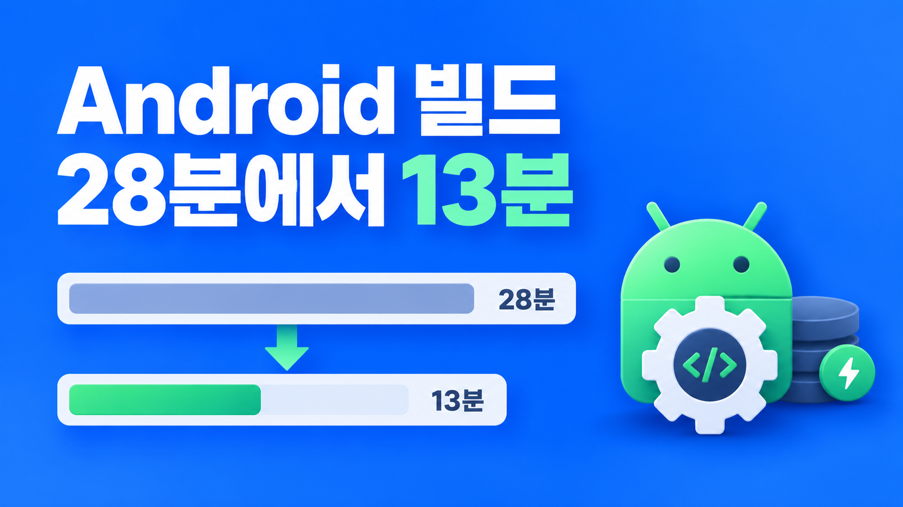

되고세이퍼 모바일 앱은 EAS(Expo Application Services) 빌드 서버에서 스토어용 바이너리를 만든다. iOS 빌드는 7분대에 끝났지만 Android 빌드는 중앙값 28분 55초가 걸렸고, 그중 28분 20초가 Gradle 단계였다.

원인은 세 가지로 좁혀졌다. 빌드마다 1,192개 태스크를 캐시 없이 처음부터 실행했고, C++ 코드를 ABI(Application Binary Interface) 4종 모두에 대해 컴파일했고, 릴리즈 빌드에서 lint까지 돌렸다. 이 글은 이 원인들을 어떤 순서로 줄였는지, 그리고 로컬 측정과 EAS 측정이 어디서 어긋났는지 다룬다.

## Gradle 단계가 빌드 시간의 거의 전부였다

EAS 빌드 서버는 빌드마다 빈 가상 머신을 할당하고, 빌드가 끝나면 폐기한다. 따로 켜지 않으면 이전 빌드의 산출물은 아무것도 남지 않는다.

| 항목          | 측정 당시                                             |
| ------------- | ----------------------------------------------------- |
| 전체 빌드     | Android 중앙값 28m 55s, iOS 7m 27s                    |
| 그중 Gradle   | 28m 20s (의존성 설치 23초, JS 번들 59초)              |
| 태스크 수     | 1,192개, 전부 실행 (`FROM CACHE` 0개)                 |
| C++ 컴파일    | ABI 4종(armeabi-v7a, arm64-v8a, x86, x86_64)마다 반복 |
| lint          | 상위 태스크 중 22개, 합 303초                         |
| JVM 힙        | `gradle.properties`에 2GB (`-Xmx2048m`)               |
| resourceClass | 기본 medium (4 vCPU / 16GB)                           |

`FROM CACHE`가 0개인 이유는 단순했다. EAS의 캐시는 두 종류 모두 opt-in이고, 우리는 켜지 않았다.

R8(코드 축소)을 처음 켠 2.0.34 빌드도 30분으로 평소 범위 안이었다. R8은 시간이 늘어난 원인이 아니었다.

## 측정은 과거 로그, 로컬 실험, EAS 확인 빌드로 나눴다

"x86을 빼면 빨라질 것 같다", "lint가 범인 같다"는 전부 짐작이었다. EAS 화면은 상위 144개 태스크만 보여 주고, 1,192개 전체 분포는 로그와 Gradle 프로필에만 있다.

과거 빌드 로그는 추가 빌드 없이 확보했다. `eas build:list --json`이 돌려주는 `logFiles`가 brotli로 압축한 JSONL이라, 지난 빌드 4건의 로그를 내려받아 태스크별 시간을 뽑았다.

변경 전후 비교는 로컬(Apple Silicon)에서 같은 명령을 2회씩 돌려 쟀다. 로컬은 비용이 들지 않으니 실험은 로컬에서 하고, EAS는 확인할 때만 썼다. 이번 작업에 쓴 EAS 빌드는 dev 프로필 3회다.

## 캐시는 Gradle 빌드 캐시와 ccache를 같이 켰다

Expo는 2026년 4월에 [Gradle 빌드 캐시](https://expo.dev/changelog/gradle-cache)를 내놓았다. 태스크 결과를 입력 해시로 보관해 두었다가 입력이 같으면 다시 실행하지 않고 꺼내 쓴다. `EAS_GRADLE_CACHE=1`로 켠다.

Gradle 캐시만으로는 부족하다. [Bitrise 글](https://bitrise.io/blog/post/how-build-cache-for-react-native-works-caching-the-cpp-your-ci-keeps-recompiling)에 따르면 React Native Gradle 플러그인의 C++(CMake) 태스크는 Gradle 빌드 캐시에 들어가지 않는다. 그래서 컴파일러 호출 단위로 결과를 보관하는 [ccache](https://docs.expo.dev/build-reference/caching/)(`EAS_USE_CACHE=1`)를 같이 켰다.

```json
// eas.json, dev 프로필
"env": {
  "EAS_GRADLE_CACHE": "1",
  "EAS_USE_CACHE": "1"
}
```

캐시 키는 lockfile의 해시다. 의존성을 바꾸면 키가 바뀌어 첫 빌드는 빈 캐시에서 시작한다. 그래서 목표를 두 가지로 나눠 잡았다.

| 이름 | 조건                                     | 목표      |
| ---- | ---------------------------------------- | --------- |
| warm | 같은 lockfile로 두 번째 이후 빌드        | 14분 이하 |
| cold | 의존성 변경 직후, 또는 캐시가 빈 첫 빌드 | 20분 이하 |

warm만 보면 착시가 생긴다. SDK를 올리는 날(우리는 분기에 한 번꼴)에는 다시 28분이다. cold 시간은 캐시가 아니라 빌드 자체를 줄여야 내려간다.

캐시는 dev 프로필에만 켰다. eas-cli로 빌드하면 캐시가 사용자마다 따로 쌓이고, 내 캐시가 비어 있으면 기본 브랜치 캐시를 빌려 쓴다. Expo 문서는 공유 계정으로 운영 빌드를 할 때 production 프로필은 캐시를 복원하지 말고 저장만 하라고 권한다(`EAS_RESTORE_CACHE=0`, `EAS_SAVE_CACHE=1`). 누가 잘못된 산출물을 캐시에 넣어도 운영 빌드에는 들어가지 않게 하는 조치다.

캐시 저장 아카이브는 ccache 88MB, Gradle 123MB부터 164MB였고, 복원과 저장을 합쳐 1분이 안 걸렸다. EAS 이미지의 Gradle 로컬 캐시에는 89개 항목이 미리 들어 있어서 cold 빌드에도 약 150개 태스크에 `FROM-CACHE`가 찍혔다. 전부 사소한 작업이라 cold로 봐도 무방했다.

## cold 빌드는 ABI 2종과 precompiled headers로 줄였다

### ABI 4종 중 2종만 빌드했다

C++ 코드는 ABI마다 한 번씩 컴파일된다.

| ABI         | 대상 기기                 | 결정                          |
| ----------- | ------------------------- | ----------------------------- |
| arm64-v8a   | 최근 Android 폰 거의 전부 | 유지                          |
| armeabi-v7a | 오래된 32비트 폰          | 현장 저사양 기기 때문에 유지  |
| x86_64      | 에뮬레이터, 일부 크롬북   | 제외 (Play 카탈로그 설치 0건) |
| x86         | 오래된 에뮬레이터         | 제외 (Play 카탈로그 설치 0건) |

x86 계열을 빼면 x86 기기에 설치할 수 없게 된다. 그래서 Play Console 기기 카탈로그 CSV를 내려받아 영향받는 사용자를 확인했고, x86 설치는 0건이었다.

설정은 eas.json `env` 한 줄이다. `expo-build-properties`에도 `buildArchs` 옵션이 있지만 EAS에서 적용되지 않는다는 이슈([expo#38225](https://github.com/expo/expo/issues/38225))가 있어서 env를 썼다.

### precompiled headers를 켰다

C++ 컴파일마다 같은 codegen 헤더를 매번 새로 처리한다. [SDK 56](https://expo.dev/changelog/sdk-56)부터는 이 헤더를 한 번만 컴파일해 재사용할 수 있다. Expo 벤치마크에서는 C++ 빌드가 17분에서 6분으로 줄었다.

아직 실험 기능이라 문서에도 "모든 네이티브 라이브러리에서 동작하지는 않을 수 있다"고 적혀 있다. 그래서 빌드 성공만 보지 않았다. dev 프로필은 AAB를 만들어서 바로 설치할 수 없었기 때문에, 빌드된 AAB를 bundletool로 APK로 바꿔 실기기에 설치해 확인했다.

ABI와 precompiled headers는 dev와 production 프로필 모두에 넣었다.

```json
"env": {
  "ORG_GRADLE_PROJECT_reactNativeArchitectures": "armeabi-v7a,arm64-v8a",
  "EXPO_USE_ANDROID_PRECOMPILED_HEADERS": "1"
}
```

## 로컬 비율은 EAS로 그대로 옮겨지지 않았다

처음 계획에는 "로컬에서 10% 이상 줄어든 변경만 EAS에서 확인한다"는 규칙이 있었다. 로컬 10코어 벽시계로 재 보니 ABI 축소는 -7%, precompiled headers는 -5%라 둘 다 이 규칙에 걸렸다.

그런데 이 규칙은 로컬 비율이 EAS에서도 비슷하게 나온다는 전제 위에 있었고, 그 전제가 틀렸다. EAS 서버는 4 vCPU다. 앱 모듈의 CMake 태스크 4종(ABI별)이 동시에 돌지 못하고 직렬로 이어져 빌드 끝에 약 10분짜리 꼬리를 만들었다. 로컬 10코어에서는 같은 작업이 병렬로 돌아 다른 태스크 뒤에 숨었다.

그래서 벽시계 비율 대신 두 숫자로 판단했다. 로컬에서 앱 CMake의 ABI당 시간은 precompiled headers로 54초에서 28초가 됐고, EAS 로그에서는 태스크 사이 공백(GAP)으로 CMake 꼬리가 빌드 끝을 붙잡고 있는 구간을 확인했다. 이 근거로 ABI 축소와 precompiled headers를 따로 나누지 않고 묶어서 EAS에서 1회 확인했다.

EAS에서 precompiled headers의 효과는 로컬보다 작았다. 앱 CMake가 ABI당 140초에서 128초로 줄었고, 로컬의 -47%에는 못 미쳤다.

## 힙과 lint는 건드리지 않았다

계획에는 Gradle 데몬의 JVM 힙을 2GB에서 4GB로 올리는 단계가 있었다. 네이티브 모듈이 많아지면 `lintVitalAnalyzeRelease`가 Metaspace OOM(Out Of Memory)을 낸다는 보고가 여럿 있었고, `gradle.properties`의 `org.gradle.jvmargs`가 2GB였기 때문이다.

실제로는 할 일이 없었다. EAS는 `GRADLE_OPTS`에 `-Dorg.gradle.jvmargs=-Xmx4g`를 넣는데, 로컬에서 init 스크립트로 확인해 보니 이 `-D` 값이 `gradle.properties`의 값을 덮었다. EAS의 Gradle 데몬은 이미 4GB로 돌고 있었다.

lintVital 비활성화(`lint { checkReleaseBuilds false }`)는 로컬에서 -19%p를 줄였다. 하지만 EAS 타임라인에서 lint는 빌드 끝 꼬리에 거의 걸려 있지 않았다. lintVital은 누락된 번역, 잘못된 API 사용처럼 릴리즈를 망칠 실수를 잡는다. 줄어드는 시간에 비해 대가가 커서 숫자만 기록하고 적용하지 않았다.

## 결과: warm 13분, cold 18분

| 조건                     | EAS Run gradlew |
| ------------------------ | --------------- |
| 기준 2.0.34              | 28m 20s         |
| 캐시 cold                | 26m 48s         |
| 캐시 warm                | **13m 00s**     |
| ABI 2종 + PCH, 캐시 없음 | 18m 01s         |

캐시 warm으로 14분 목표를, ABI 2종과 precompiled headers(PCH)로 cold 20분 목표를 맞췄다. 앱 코드와 네이티브 코드는 한 줄도 바뀌지 않았고, 변경은 전부 `eas.json`의 env였다.

ABI와 PCH를 적용한 뒤의 임계 경로는 R8(`minifyReleaseWithR8`, 507초)이었다. 이전에는 CMake 꼬리 밑에 겹쳐 있어서 보이지 않았다.

## 다른 팀은 얼마나 줄였나

조사한 글 중에서 숫자를 직접 확인한 것만 추렸다.

| 출처                                                                                                                                                       | 방법                                          | 전 → 후                                       |
| ---------------------------------------------------------------------------------------------------------------------------------------------------------- | --------------------------------------------- | --------------------------------------------- |
| [ava-labs core-mobile](https://github.com/ava-labs/core-mobile/pull/4060)                                                                                  | Gradle 원격 캐시 + ccache                     | AAB 릴리즈 20.7분 → 16.1분, e2e 29.6분 → 12.6분 |
| [Bitrise](https://bitrise.io/blog/post/how-build-cache-for-react-native-works-caching-the-cpp-your-ci-keeps-recompiling)                                   | Gradle 캐시 + 원격 ccache                     | 약 17분 → 약 9분                              |
| [reown RN 예제](https://github.com/reown-com/react-native-examples/pull/630)                                                                               | 내부 빌드 arm64만 + Gradle 캐시               | cold 약 24분 / warm 약 15분                   |
| [Duolingo](https://blog.duolingo.com/sped-up-android-ios-builds/)                                                                                          | 하드웨어, 작업 재배치, 원격 Gradle 캐시, KSP  | 50분 → 16분                                   |
| [Callstack](https://www.callstack.com/blog/were-building-a-new-react-native-framework)                                                                     | fingerprint로 네이티브 산출물 재사용          | 34분 → 3분 (서명하지 않은 개발 빌드)          |

공통점은 캐시가 1순위라는 것이었다. 다만 C++까지 캐시하지 않으면 효과가 반쪽이었다. reown 사례에서는 `.cxx` 폴더를 통째로 캐시해도 CMake 시간이 그대로였다(둘 다 1분 50초).

개발 빌드와 스토어 빌드는 줄어드는 폭이 달랐다. 34분이 3분이 되는 숫자는 대부분 서명하지 않은 개발 빌드였고, 우리와 규모가 가장 비슷한 ava-labs의 릴리즈 빌드는 -22%였다. 그래서 스토어용 AAB는 20%대 단축을 현실적인 기대치로 잡고 시작했다.

## 택하지 않은 방식

| 방식                                       | 택하지 않은 이유                                                                        |
| ------------------------------------------ | --------------------------------------------------------------------------------------- |
| 로컬 빌드로 배포 전환                      | 서명과 재현성이 사람에게 묶인다                                                         |
| resourceClass large (8 vCPU / 32GB)        | 빌드마다 비용이 늘고, Android 단축 폭을 보여 주는 공개 실측이 없었다                    |
| lintVital 비활성화                         | EAS에서는 lint가 임계 경로에 거의 없었고, 릴리즈 안전망이 사라진다                      |
| `cache.paths`로 `~/.gradle` 직접 캐시      | `EAS_GRADLE_CACHE`가 같은 일을 한다. reown 사례에서도 폴더 캐시는 CMake에 효과가 없었다 |
| RNRepo (Software Mansion 사전 빌드 저장소) | 베타이고 EAS 연동 방법이 불분명했다                                                     |
| configuration cache, Kotlin 데몬 정리      | clean 빌드에서는 효과가 작다 (Square, Iñaki Villar 사례)                                |
| 의존성 정리로 모듈 수 줄이기               | 효과는 크겠지만 기능 검토가 따로 필요한 작업이다                                        |
| Gradle `--scan`                            | 빌드 정보를 외부 서비스로 보낸다                                                        |

## 로컬 비율보다 EAS의 임계 경로를 봐야 했다

이번 작업에서 가장 크게 어긋난 것은 측정 방식이었다. 로컬 10코어에서 -7%, -5%로 보인 변경이 4 vCPU EAS에서는 캐시 없는 빌드를 10분 넘게 줄였다. 코어 수가 다르면 병렬로 숨는 작업과 직렬로 드러나는 작업이 달라진다. 로컬 실험은 변경 하나의 효과를 태스크 단위로 재는 데 쓰고, 벽시계 비율로 EAS 결과를 예측하지 않는 편이 맞았다.
