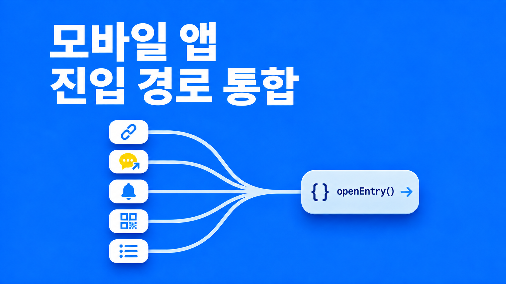

Expo Router 기반 안전관리 앱에는 앱 밖에서 특정 화면을 여는 진입점이 다섯 개 있다. 웹 링크, 카카오톡 shortcut 링크, 푸시 알림 탭, 현장 QR 스캔, 홈의 알림 목록이다. 진입점마다 처리 코드가 따로 있었고, 코드를 대조하고 백엔드 코드까지 확인한 결과 고칠 문제가 10건 나왔다.

이 글에서는 문제의 원인, 참고한 외부 사례, 최종 구조인 "받기 → 해석 → 판정 → 이동" 파이프라인을 정리한다.

## 문제 10건과 원인

| #   | 문제                                                                         |
| --- | ---------------------------------------------------------------------------- |
| 1   | 로그인 전에 보관한 링크가 사업장 선택 직후 사라짐                            |
| 2   | 포그라운드에서 알림을 받기만 해도 화면 이동                                  |
| 3   | `getLastNotificationResponseAsync`를 JS 시작 때마다 다시 처리                |
| 4   | 푸시 탭 이동이 동작하지 않음 (서버는 `data.url`만 보내는데 앱은 `data.code`를 찾음) |
| 5   | 비로그인 상태의 shortcut 링크가 로그인 후 원래 목적지로 돌아오지 않음        |
| 6   | QR 서버 조회 중 로딩 표시가 없음                                             |
| 7   | 로그아웃해도 보관한 링크를 비우지 않음                                       |
| 8   | 다른 사업장 링크는 "전환 후 다시 여세요" 안내만 하고 목적지를 버림           |
| 9   | 목록에는 보이는데 진입하면 안내 없이 실패 (목록·진입 검사 기준 불일치)       |
| 10  | 스킴만 있는 `duegosafer://`로 앱을 열면 "지원하지 않는 링크" 화면이 뜸 |

8번의 다른 사업장 안내는 딥링크, shortcut, QR 세 곳에서 각각 alert를 띄우고 끝난다. 카카오톡 링크나 현장 QR은 사용자가 다시 찾기 어려운 진입점이라 목적지를 버리는 비용이 크다.

1번부터 8번까지는 원인이 두 가지로 모인다.

1. **진입점마다 해석·이동·보관을 따로 한다.** 해석기 `resolveMobilePath`가 있었지만 푸시와 QR은 이걸 쓰지 않았다. 이동도 진입점마다 `router.push`를 직접 불렀다.
2. **보관한 목적지를 관리하는 주체가 없다.** 딥링크 처리기는 `pendingUrlRef`에 링크를 보관하지만, shortcut은 보관하지 않는다. 언제 꺼내고 언제 비우는지도 정해져 있지 않다.

1번이 대표적이다. 사업장을 고르면 상태가 `selected`로 바뀌고, 딥링크 처리기는 이를 감지해 보관한 링크로 `push`한다. 같은 시점에 사업장 선택 화면도 서약 여부를 조회한 뒤 자기 규칙대로 `replace`나 `back`을 한다. 두 곳이 서로 모르고 이동하므로 순서가 보장되지 않고, 늦게 실행된 쪽의 이동이 남는다.

## 참고한 외부 사례

### 진입점과 라우트 테이블을 하나로

Airbnb의 DeepLinkDispatch는 모든 링크를 하나의 입구에서 받아 라우트 테이블에서 찾는다. 성공과 실패를 이벤트로 남겨 깨진 링크를 측정한다. Yelp는 외부 링크마다 검증·파싱 계층을 먼저 거치게 하고, 헤이딜러도 "SchemeActivity 하나로 끝내기"라는 같은 방향의 글을 남겼다.

우리 앱에는 이미 `resolveMobilePath`가 있었으므로, 모든 진입점이 이 함수를 거치게 하면 된다.

### 해석과 이동의 분리

29CM은 6년 동안 `RootController` 하나가 모든 화면 이동을 맡았고, god object가 되어 리팩토링으로 걷어냈다. AutoScout24는 수신·파싱·라우팅·상태를 계층으로 나누고 파싱과 라우팅을 순수 함수로 테스트한다. 여기서 얻은 결론은 해석기는 목적지 데이터만 돌려주고 이동은 한 곳에서만 해야 한다는 것이다.

### 조건부 링크의 재투입

Yelp는 로그인이 끝나면 원래 링크를 파이프라인에 다시 넣는다. Uber는 "로그인 대기 → 다음 단계 → 목적지" 같은 단계 체인을 정의한다. Slack은 이동 직전에 `isReadyForPresentingURL()`을 호출하고, 결과는 셋 중 하나다. 로딩 중이면 대기, 현재 팀이 맞으면 즉시 이동, 다른 팀이면 팀 전환 후 이동이다.

우리 앱의 조건은 "로그인 → 사업장 선택 → 서약" 3단계다. Yelp보다 복잡하지만 Uber 수준의 프레임워크는 필요 없어서 Slack의 3분기 구조를 택했다.

React Navigation 문서도 로그인 상태가 바뀔 때 화면에서 직접 navigate하지 말라고 경고한다. 로그인 화면과 링크 처리기가 각자 이동하면 경합이 생기는데, 1번 문제가 이 경우다.

### 다른 워크스페이스 링크

우리 앱의 "다른 사업장"은 협업 도구의 "다른 워크스페이스"와 같은 문제다.

- 카카오워크는 2022년 전까지 활성 워크스페이스 알림만 받았다. 놓친 알림 불만이 나오자 모든 워크스페이스 알림을 받고 탭하면 바로 진입하도록 바꿨다. Teams와 Element도 다른 계정 알림을 탭하면 그 계정으로 전환해서 연다.
- Figma는 공유 링크를 묻지 않고 현재 계정으로 열었다. 그 결과 프리랜서의 다른 고객사 이메일이 협업자에게 노출됐다.
- 오픈소스 sprintable은 링크를 열면 조직을 자동 전환했다. 전환 시 모든 기기의 토큰이 폐기되는 구조라서 악의적인 링크 하나로 다른 사용자를 강제 로그아웃시킬 수 있었다. 이후 확인 버튼을 누를 때만 전환하도록 바꿨다.
- 한 Apollo 사례는 스피너 0.5초를 없애려고 전환 시 캐시 리셋을 뺐다. 1초 동안 이전 회사 데이터가 보였고, 신고까지 6주가 걸렸다.

확인 없이 현재 계정으로 열기, 확인 없이 자동 전환, 전환 시 캐시 미삭제가 각각 사고로 이어졌다.

국내 기술 블로그의 딥링크 글은 대부분 스킴과 Universal Link 비교, 앱 설치 여부 판별 같은 마케팅·웹 주제였다. 로그인 후 복귀나 중앙 라우터를 다룬 글은 찾지 못했다.

## 설계: 받기 → 해석 → 판정 → 이동

다섯 진입점의 요청을 모두 하나의 파이프라인으로 처리한다.

```text
 [받기]                  [해석]                    [판정]                          [이동]
 외부 링크 ─┐                                      ┌─ 준비 안 됨(로그인 전) ──▶ 보관 ──▶ 로그인 화면
 shortcut  ─┤  URL로     resolveMobilePath         │
 푸시 탭   ─┼─ 정규화 ─▶ (순수 함수, 이미 있음) ─▶ ├─ 같은 사업장 ──────────────────────▶ router.push
 QR        ─┤                                      │
 알림 목록 ─┘                                      ├─ 내가 속한 다른 사업장 ─▶ 확인 ─▶ 보관 ─▶ 사업장 진입
                                                   ├─ 속하지 않은 사업장 ─▶ 안내하고 멈춤
                                                   └─ 앱 미지원 / 외부 웹 ─▶ 기존 처리
```

| 단계 | 담당                        | 역할                                   |
| ---- | --------------------------- | -------------------------------------- |
| 받기 | 각 진입점                   | 입력을 URL 하나로 정규화               |
| 해석 | `resolveMobilePath` (기존)  | URL을 목적지 데이터로 변환 (순수 함수) |
| 판정 | `openEntry(url, source)`    | 지금 이동할 수 있는지 결정             |
| 이동 | `openEntry(url, source)`    | 실제 화면 이동                         |

진입점에서 `router.push`를 직접 호출하는 코드는 모두 없앴다.

### 대기 목적지: 한 칸, 소비 지점 하나

로그인 전이거나 다른 사업장이라 바로 이동할 수 없는 목적지는 대기 목적지로 보관한다.

```ts
type PendingEntry = {
  url: string; // 해석이 끝난 최종 URL
  targetCompanySeq: string | null;
  userId: string | null; // 넣을 때의 로그인 사용자 (로그인 전이면 null)
  expiresAt: number; // 넣은 시각 + 10분
};
```

규칙은 다음과 같다.

- **한 칸만 둔다.** 새 링크가 오면 덮어쓴다. 마지막으로 누른 링크를 사용자 의도로 본다.
- **메모리에만 둔다.** 앱이 종료된 상태에서 링크로 실행하면 OS가 링크를 다시 전달하므로 디스크에 저장할 이유가 없다. 디스크에 남기면 다른 사용자의 기기에서 이전 사용자의 링크가 열릴 수 있다.
- **꺼낼 때 검증한다.** 10분이 지났거나 넣을 때와 현재 사용자가 다르면 버린다.
- **대상 사업장이 있으면 그 사업장 진입 때만 꺼낸다.** 확인 후 사업장 선택 화면에서 나갔다가 나중에 프로필에서 직접 사업장을 바꿨을 때 엉뚱한 문서가 열리지 않게 하기 위해서다. 사업장 선택에서 뒤로 나가면 비운다.
- **로그아웃과 세션 만료 때 비운다.** 7번 문제가 여기서 해결된다.

대기 목적지를 꺼내는 곳은 **사업장 진입이 끝나는 지점 한 곳**뿐이다. 사업장 선택 화면은 원래 "선택 → 서약 확인 → 이동" 순서로 동작했고, 여기서 목적지를 정할 때 대기 목적지를 확인하도록 했다. 로그인 전에 들어온 링크, 다른 사업장 링크, 사용자의 수동 사업장 전환이 모두 이 지점을 지나므로 경합이 생기지 않는다.

Expo 블로그나 Software Mansion 글 등 많은 자료는 앱 루트에서 로그인 상태 변화를 감지해 보관한 링크를 꺼낸다. 우리 앱은 사업장 선택 뒤에 서약 단계가 있어서 이 방식을 쓰면 서약을 건너뛰거나 서약 화면이 목적지를 덮어쓴다. 서약 화면까지 목적지를 넘기는 `returnTo`가 이미 있었으므로 그 시작점에서 꺼내는 쪽이 변경이 가장 적었다. Slack이 로그인과 팀 선택이 끝나는 한 지점에서 링크를 소비하는 것과 같은 구조다.

예외가 하나 있다. 로그인한 상태로 앱을 종료한 뒤 링크로 다시 실행하면 세션이 복원되면서 사업장 선택 화면을 거치지 않는다. 이때 대기 목적지에 넣으면 꺼내는 곳이 없다. 그래서 인증 복원 중에 들어온 요청은 잠시 들고 있다가 상태가 확정되면 파이프라인에 다시 넣는다(Yelp의 재투입 방식). 이동이 아니라 재판정이므로 소비 지점은 여전히 하나다.

### 다른 사업장 링크는 확인 후 전환

다른 사업장 링크가 오면 판정 시점에 사업장 목록을 서버에서 새로 받아 소속 여부를 확인한다.

- **소속된 사업장:** "○○ 사업장 문서예요. 사업장을 바꾸고 열까요?"를 묻는다. 수락하면 목적지를 보관하고 그 사업장으로 자동 진입한다.
- **소속되지 않은 사업장:** 볼 수 없다고 안내하고 멈춘다. 사업장 이름은 노출하지 않는다.

목록 기준과 진입 기준이 달라서 사전 확인을 통과해도 진입이 거부될 수 있다. 이 경우는 뒤에서 설명할 903 처리가 안내한다.

업계에서는 대체로 푸시 탭은 자동 전환, 링크는 확인 후 전환으로 나뉜다. 첫 버전에서는 둘 다 확인을 받기로 했다.

- 전환하면 작성 중인 폼이 사라지는데, 앱에 폼 변경 감지 장치가 없다.
- 안전관리 앱이라 현장에서 다른 사업장 QR을 잘못 찍었을 때의 비용이 크다.
- sprintable 사례처럼 링크로 자동 전환하면 외부에서 사용자 컨텍스트를 강제로 바꿀 수 있다.
- "확인 → 진입" 경로 하나만 구현하면 된다.

### 사업장 전환 시 데이터 격리

쿼리 캐시는 이미 invalidate가 아니라 `removeQueries`로 제거하고 있어서 이전 데이터가 잠깐 보일 일은 없었다. 여기에 두 가지를 추가했다.

- 전환 전에 진행 중인 요청을 `cancelQueries`로 취소한다. 늦게 도착한 이전 사업장 응답이 캐시에 다시 들어가는 것을 막는다.
- 보관한 목적지로 이동할 때는 `dismissTo(HOME)`으로 스택을 새 사업장 홈까지 정리한 뒤 `push`한다. 서약 완료 후 이동도 같다. 스택에 이전 사업장의 문서 화면이 남아 있으면 back을 눌렀을 때 이전 사업장의 문서 ID로 새 사업장 API를 호출하기 때문이다.

### 푸시와 QR

푸시는 수신 시 알림 목록만 갱신하고, 화면 이동은 탭에서만 한다(2번). Expo 공식 예제, OneSignal, FCM(Firebase Cloud Messaging) 모두 이 방식이다. 중복 처리는 두 단계로 막았다(3번).

- 처리한 응답은 즉시 비워서 JS 재시작 후 다시 처리되지 않게 한다.
- 처리한 알림 ID를 기록해서, 콜드 스타트 때 리스너와 마지막 응답이 동시에 들어오는 경우를 걸러낸다.

`useLastNotificationResponse` 훅은 콜드 스타트 이중 발화 버그(expo#30649)가 있어서 쓰지 않았다.

QR은 스캔 직후 모달을 닫던 동작을 바꿨다(6번). 카메라를 연 채로 로딩 표시를 띄우고, 조회가 끝나면 모달을 닫고 `openEntry`에 넘긴다. 실패하면 안내 후 다시 스캔할 수 있게 하고, 조회 중 사용자가 닫으면 응답이 와도 이동하지 않는다.

## 백엔드 코드에서 확인한 것

설계 중 서버팀에 확인할 질문이 다섯 개 생겼고, 백엔드 코드를 직접 읽어 답을 얻었다. 그 과정에서 4번과 9번 문제가 드러났다.

### 푸시 탭 이동이 동작하지 않았다 (4번)

앱은 푸시 payload의 `data.code`를 보고 이동하도록 되어 있었다. 메시지 서버가 보내는 payload는 다음이 전부였다.

```ts
{ to, title, body: "", data: { url } }
```

`code` 필드가 없으므로 앱의 `if (typeof data?.code === 'string')` 조건은 항상 거짓이었다. 푸시 탭 이동 전체가 동작하지 않는 상태였다.

`url` 값은 `/open/shortcutRedirect?code=...`로 카카오톡 shortcut 링크와 형식이 같다. `code`를 꺼내 shortcut 해석 경로로 넘기도록 바꿨고, 서버 변경은 필요 없었다. 이제 shortcut, QR, 푸시가 같은 경로를 탄다. 기존 푸시 전용 라우터와 라우트 테이블은 삭제했다.

서버는 알림 수신자를 계정의 푸시 토큰으로 찾는다. 앱에서 어느 사업장을 보고 있든 다른 사업장 알림은 이미 오고 있었고, 다른 사업장 확인 흐름이 푸시에서도 필요하다는 뜻이다.

### 목록과 진입 검사의 기준이 달랐다 (9번)

| 대상   | 목록 API 노출 조건 | 진입 검사 통과 조건                   |
| ------ | ------------------ | ------------------------------------- |
| 근로자 | `status != 'D'`    | `status = 'A'` 그리고 부서 `status = 'A'` |
| 파트너 | `status != 'D'`    | `status = 'A'`                        |

두 조건 사이에 걸린 사업장을 누르면 서버가 권한 없음(903)을 돌려준다.

903 응답은 세션 무효 처리로 이어지지 않는다. 이 에러는 HTTP 200에 본문 `status: 903`으로 온다. 성공 인터셉터가 이를 reject하는데, axios는 인터셉터 쌍을 `then(fulfilled, rejected)`로 연결하므로 같은 단계의 에러 인터셉터에 닿지 않는다. 그래서 증상은 로그아웃이 아니라, 에러 처리가 없어 카드 로딩만 멈추고 안내가 뜨지 않는 것이었다.

사업장 선택의 `onError`에서 "이 사업장에 들어갈 수 없어요"를 안내하도록 했다. 이 수정은 다른 작업보다 먼저 했다. 지금도 사업장을 직접 고를 때 발생할 수 있고, 다른 사업장 자동 진입(8번)이 생기면 이 경로를 더 자주 타기 때문이다.

두 문제 모두 앱에서 해결했고, 이번 작업에 서버 변경은 없었다.

## 실기기 검증에서 추가로 고친 것

Android 실기기 검증에서 코드 대조로는 보이지 않던 문제가 더 나왔다.

- **로그인 전 안내 alert가 표시되지 않음.** 로그인 전에 링크를 열면 "로그인하면 이어서 열어 드려요"를 alert로 띄우도록 했는데, 링크 수신과 동시에 라우트가 로그인 화면으로 바뀌면서 오버레이 정리 로직이 alert를 지웠다. toast로 바꿨다.
- **앱 사용 중 링크를 받으면 보던 화면이 홈으로 바뀜.** `+native-intent`의 `redirectSystemPath`가 workplace 링크를 항상 `/`로 돌리고 있었다. 앱 실행 중에는 `null`을 돌려 라우터가 이동하지 않게 하고, 콜드 스타트일 때만 `/`로 보내도록 바꿨다. 이제 확인창에서 [닫기]를 누르면 원래 화면이 유지되고, 같은 사업장 링크는 보던 화면 위에 열려 back으로 돌아올 수 있다.
- **경로 없는 스킴(10번).** 웹 `executeApp` 페이지의 "앱 열기"는 `duegosafer://`로 앱만 실행한다. 경로 없는 스킴도 위와 같은 규칙을 적용해 미지원 화면이 뜨지 않게 했다.
- **Android 푸시 토큰 발급 실패.** `google-services.json`이 빠져 있어 "Unable to get Firebase Messaging instance" 에러가 났다. Expo 푸시도 Android에서는 FCM 설정이 필요하다. 네이티브 설정이라 OTA(Over-the-Air) 업데이트로는 반영되지 않고 새 빌드가 필요하다.

## 택하지 않은 방식

| 방식                          | 택하지 않은 이유                                                                       |
| ----------------------------- | -------------------------------------------------------------------------------------- |
| `Stack.Protected`로 가드 전환 | SDK 57에는 원래 목적지를 보존하는 `redirectTo`가 없어 이번 문제를 풀지 못한다          |
| 딥링크마다 스택 재구성        | Shopify가 React Native 전환 때 포기한 방식. 기존 "returnTo → canGoBack → 기본 화면" back 규칙으로 충분하다 |
| Uber식 단계 체인              | 조건이 3단계뿐이라 과하다. 소비 지점을 하나로 모으는 것으로 같은 효과를 얻는다         |

## 정리: 이동 지점 하나, 소비 지점 하나

진입 경로 문제는 대부분 "여러 곳이 각자 이동한다"와 "보관한 목적지를 관리하는 주체가 없다"에서 나왔다. 그래서 이동은 `openEntry` 한 곳에서만 하고, 대기 목적지는 사업장 진입이 끝나는 한 지점에서만 꺼내도록 했다.

---

## 참고 자료

- [Airbnb: DeepLinkDispatch](https://medium.com/airbnb-engineering/deeplinkdispatch-778bc2fd54b7)
- [Uber: RIBs Deeplinking & Workflows](https://github.com/uber/RIBs/wiki/Android-Tutorial-4)
- [Yelp: Android navigation performance](https://engineeringblog.yelp.com/2024/10/how-we-improved-our-android-navigation-performance-by-~30.html)
- [Yelp: Passwordless Login](https://engineeringblog.yelp.com/2021/03/passwordless-login.html)
- [Slack: Into the Clouds](https://slack.engineering/into-the-clouds/)
- [Shopify: Migrating to React Native](https://shopify.engineering/migrating-our-largest-mobile-app-to-react-native)
- [AutoScout24: iOS UI Testing with Deep Links](https://tech.autoscout24.com/blog/posts/ios-uitest-deeplink/)
- [카카오워크: 비활성 워크스페이스 알림](https://blog.kakaowork.com/154)
- [sprintable: 다른 org 알림은 전환 카드로](https://github.com/moonklabs/sprintable/pull/4797)
- [Figma: 공유 링크 계정 선택](https://forum.figma.com/suggest-a-feature-11/account-selection-when-opening-shared-links-and-privacy-issues-41010)
- [Apollo 캐시 리셋 누락 사고](https://dev.to/darshan_turakhia/how-skipping-a-cache-reset-for-speed-let-apollo-client-show-the-wrong-tenant-2p18)
- [React Navigation: Authentication flows](https://reactnavigation.org/docs/auth-flow/)
- [Expo: Customizing links (+native-intent)](https://docs.expo.dev/router/advanced/native-intent/)
- [Expo: Notifications SDK](https://docs.expo.dev/versions/latest/sdk/notifications/)
- [expo/expo#30649](https://github.com/expo/expo/issues/30649)
