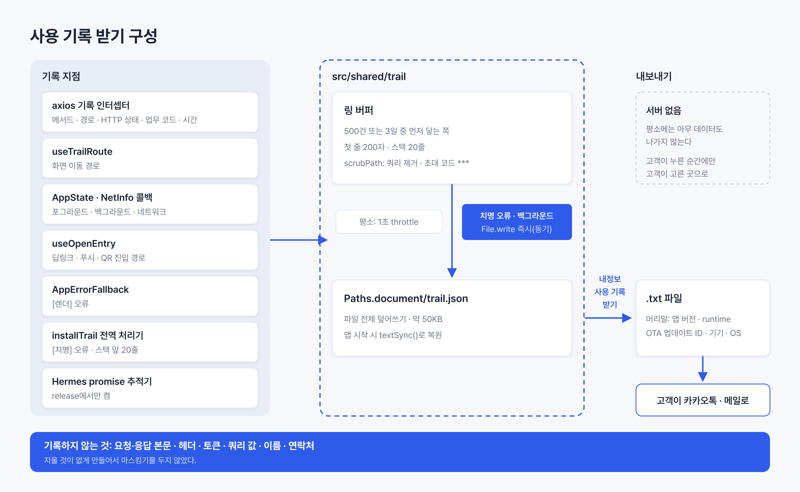

되고세이퍼 모바일 앱의 장애 문의는 대부분 "저장이 안 돼요", "결재 버튼이 안 눌려요" 같은 기능 오류였다. 앱이 죽지 않았으니 크래시 수집기에는 아무것도 남지 않았다. 상담원이 전화로 기기와 화면을 묻고, 개발자가 재현을 시도하고, 재현하지 못하면 거기서 끝났다.

그래서 문의에 기록을 붙이기로 했다. 앱이 화면 이동, API 호출, 오류를 폰 안의 파일에 최근 500건 또는 3일치만 쌓아 둔다. 고객이 내정보의 "사용 기록 받기"를 누르면 그 기록이 `.txt` 파일로 나온다. Android는 다운로드 폴더에 저장되고, iOS는 공유 시트가 열린다. 고객은 그 파일을 카카오톡이나 메일로 보낸다. 서버는 두지 않았다. 평소에는 아무 데이터도 나가지 않고, 고객이 누른 순간에만 고객이 고른 곳으로 간다.

설계의 핵심 판단은 두 가지였다. 본문·헤더·쿼리 값을 애초에 기록하지 않아서 마스킹할 것이 없게 했다. 그리고 치명적 JS 오류와 백그라운드 전환 직후에는 파일 쓰기를 동기로 끝냈다. React Native 어디에도 비동기 쓰기가 끝난다는 보장이 없었기 때문이다.

기준 환경은 모바일 v2.0.34, Expo SDK 57, React Native 0.86, Hermes다.



## 크래시 수집기에 남지 않는 기능 오류

앱에는 이미 Play Console 지표, App Store Connect 지표, EAS Observe 오류 수집이 붙어 있었다. 세 가지가 보는 것은 크래시, ANR(Application Not Responding), 시작 시간, 렌더 오류다. 전부 "앱이 멈추거나 죽었다"는 사건이다.

업무 앱의 장애는 모양이 달랐다. 위험성평가 등록 화면에서 저장을 눌렀는데 서버가 업무 오류 1301을 돌려주고, 앱은 그 오류를 사용자에게 보여 주지 못한 채 버튼만 다시 활성화하는 경우가 있었다. 이 사건은 HTTP 200으로 끝나고 JS 예외도 없다. 어떤 크래시 수집기에도 걸리지 않는다.

iOS는 사정이 더 나빴다. App Store Connect API는 크래시 건수만 주고 스택은 Xcode Organizer 화면에서만 볼 수 있다. Observe가 오류를 모으긴 했지만 우리 계정은 On-demand 플랜이라 오류 조회가 막혀 있었다. iOS에서 "뭔가 안 돼요"가 들어오면 볼 수 있는 기록이 하나도 없었다.

문의 한 건에 다음 세 가지가 붙으면 대부분의 원인은 재현 없이 좁혀진다고 봤다.

- 문의 직전 몇 분 동안 어떤 화면을 거쳤나
- 어떤 API가 어떤 상태로 끝났고 얼마나 걸렸나
- JS 오류가 있었다면 메시지와 스택 앞부분

이 세 가지를 폰에 남겼다가 고객이 보내게 하는 것이 이 작업의 전부였다.

## OS 로그는 일반 사용자가 꺼낼 수 없었다

OS에도 로그는 있다. 하지만 두 플랫폼 모두 그 로그를 개발자에게만 열어 둔다.

Android의 logcat 버퍼는 기본 256KB이고 저사양 기기에서는 64KB라 몇 분이면 덮인다. `adb logcat`은 USB 디버깅과 PC가 필요하고, 설정의 "버그 신고" 메뉴는 개발자 옵션을 켜야 나타난다. 앱이 다른 앱의 로그를 읽는 `READ_LOGS` 권한은 Android 13부터 시스템 UID 같은 예외를 빼고 거부된다.

iOS의 sysdiagnose는 볼륨 양쪽과 사이드 버튼을 250밀리초 동안 함께 누르고 10분을 기다린 뒤, 설정의 분석 데이터에서 파일을 찾아 Mac으로 AirDrop해야 한다. OSLog는 동적 문자열을 기본으로 `<private>`로 가려서 앱이 남긴 경로나 오류 문구가 보이지 않는다.

현장 근로자에게 "개발자 옵션을 켜고 버그 신고를 눌러 보내 주세요"라고 안내할 수는 없었다. 고객이 상담원에게 보낼 파일은 앱이 직접 만들어야 했다.

## 다른 앱의 디버그 로그 방식

같은 문제를 푼 앱들을 먼저 살펴봤다.

| 앱                                                                                                              | 저장                                  | 민감 정보                                                                       | 보내는 방법                                       |
| --------------------------------------------------------------------------------------------------------------- | ------------------------------------- | ------------------------------------------------------------------------------- | ------------------------------------------------- |
| Signal(Android)                                                                                                 | SQLite, 20MiB·3일(표시한 로그는 21일) | 전화번호·UUID는 HMAC 해시, 이메일은 첫 글자만, URL은 TLD만 남긴다               | debuglogs.org에 gzip으로 올리고 URL을 복사해 전달 |
| [Bitwarden Flight Recorder](https://bitwarden.com/help/flight-recorder/)                                        | 기본 꺼짐, 켜면 30일 뒤 만료          | 마스터 비밀번호·금고 데이터는 기록하지 않는다                                   | 기기에만 저장, 자동 전송 없음, 공유는 사용자만    |
| Thunderbird(Android)                                                                                            | 사용자가 켬                           | "계정·기기 정보가 들어갈 수 있다"고 경고하고 비밀번호·토큰은 직접 지우라고 안내 | "Export logs"로 파일 저장                         |
| Element(Matrix) rageshake                                                                                       | 상한 없음                             | 메시지 본문·개인 키는 제외, 사용자·방·이벤트 ID는 포함                          | 신고에 동의할 때만 서버로 전송                    |
| [Home Assistant Companion](https://companion.home-assistant.io/docs/troubleshooting/faqs/)                      | logcat 기반                           | "Home Assistant URL 등은 직접 지우라"고 안내                                    | "Show and Share Logs"                             |

[Signal](https://github.com/signalapp/Signal-Android/blob/main/core/util-jvm/src/main/java/org/signal/core/util/logging/Scrubber.kt)이 가장 정교하다. 식별자를 지우지 않고 HMAC으로 해시해서, 같은 사람이 로그 여러 곳에 나오면 같은 해시로 묶어 볼 수 있다. 대신 debuglogs.org라는 업로드 서버를 운영한다.

Bitwarden은 가장 단순하다. 기기에만 저장하고 자동 전송이 없으며 시작·중지·공유를 전부 사용자가 한다. 우리는 이 모델을 따랐다. 서버가 필요 없고, 데이터가 나가는 순간이 사용자 행동 하나로 정해지기 때문이었다.

Thunderbird와 Home Assistant의 "민감 정보는 직접 지우라"는 안내는 우리 고객에게 맞지 않았다. 현장 근로자가 텍스트 파일을 열어 토큰을 찾아 지우는 일은 성립하지 않는다. 지울 것이 없게 만드는 쪽을 택했다.

Element는 상한이 없는 로그가 어디까지 가는지 보여 준다. rageshake 하나가 압축 전 550MB, 857만 줄이었다는 [이슈](https://github.com/element-hq/element-android/issues/9096)가 있다. 건수·기간·줄 길이에 전부 상한을 둔 이유다.

## 본문·헤더·쿼리 값은 기록하지 않았다

기록 한 줄은 Sentry의 breadcrumb과 같은 단위로 잡았다. Sentry는 navigation·http·ui 같은 타입별 작은 사건을 최대 100개 쌓아 두었다가 오류가 나면 함께 보낸다. http breadcrumb에는 url·method·status_code만 들어간다. 우리는 같은 범위에 걸린 시간을 더했다.

| 종류      | 남기는 것                                                           | 남기지 않는 것                        |
| --------- | ------------------------------------------------------------------- | ------------------------------------- |
| 화면 이동 | 경로(동적 세그먼트의 문서 seq 포함)                                 | 쿼리 전체                             |
| API       | 메서드, 경로, HTTP 상태, 업무 오류 코드, 걸린 시간                  | 요청·응답 본문, 헤더, 토큰, 쿼리 전체 |
| API 실패  | 위 항목 + 서버 오류 문구 앞 100자                                   | 본문 나머지                           |
| 앱 오류   | 메시지와 스택 앞 20줄                                               | 없음                                  |
| 앱 상태   | 포그라운드·백그라운드, 네트워크 연결·끊김                           | 없음                                  |
| 진입      | 딥링크·푸시·QR로 들어온 경로                                        | 링크의 쿼리 전체                      |
| 머리말    | 앱 버전, runtime, OTA 업데이트 ID, 기기, OS, 사업장 seq, 근로자 seq | 이름, 연락처, 문서 내용               |

Sentry와 갈린 지점은 쿼리였다. [Sentry React Native 문서](https://docs.sentry.io/platforms/react-native/data-management/data-collected/)는 "The full request query string is always sent"라고 적는다. 되고세이퍼의 쿼리 값에는 초대 코드(`inviteCode`)와 돌아갈 경로(`returnTo`)가 들어간다. 그래서 `?` 뒤를 통째로 잘랐다. 키 이름만 남기는 방식은 택하지 않았다. expo-router의 `usePathname`에는 쿼리가 애초에 없어 따로 붙여야 하고, 값이 빠진 키 이름은 화면 종류를 말해 주지 않는다.

쿼리만 자르면 끝나지 않았다. 초대 링크 라우트 `/invitation/code/[inviteCode]`는 코드가 쿼리가 아니라 경로 세그먼트에 있다. 경로를 정리하는 `scrubPath`가 이 경로를 `/invitation/code/***`로 바꾸게 했다. 반면 `/riskAssessmentPlan/123` 같은 문서 seq는 남겼다. 그 자체로는 개인정보가 아니고 서버 로그와 맞춰 볼 때 필요했다.

서버 오류 문구는 앞 100자만 남겼다. Sentry `maxValueLength` 기본값 250자보다 짧다. 한 줄에 사건 하나를 유지하려는 선택이었고, 되고세이퍼 서버의 업무 오류 문구는 대부분 한 문장이라 100자를 넘지 않았다.

근로자 seq는 개인정보지만 넣었다. 서버 로그에서 같은 시각의 요청을 찾을 때 유일한 열쇠였기 때문이다. 이름과 연락처는 넣지 않았다.

마스킹기는 만들지 않았다. Signal의 Scrubber는 전화번호·이메일·UUID·IP·URL 패턴을 정규식으로 찾아 해시하거나 지운다. 본문과 헤더를 기록하니 필요한 장치다. 우리는 그것을 기록하지 않으므로 지울 패턴이 없었다.

API 기록은 axios에 기록 전용 인터셉터 쌍을 따로 두고, 기존 인터셉터 쌍보다 먼저 등록했다.

## 치명적 오류 직후에도 파일에 남겼다

가장 큰 기술 위험은 여기였다. 기록이 가장 필요한 순간은 JS 엔진이 내려가기 직전인데, 그 순간에 파일 쓰기가 끝난다는 보장이 있는지가 문제였다.

### React Native의 치명적 오류 흐름

`ErrorUtils.setGlobalHandler`로 등록한 처리기는 `(error, isFatal)`을 받는다. React Native의 기본 처리기는 `ExceptionsManager.handleException`이고, release 빌드에서 `isFatal`이면 `NativeExceptionsManager.reportException`을 부른다. 이 호출은 비동기 네이티브 호출이다. Android의 `ExceptionsManagerModule`은 `JavascriptException`을 throw하고 `DefaultJSExceptionHandler`가 그대로 다시 던져 프로세스가 끝난다. iOS의 `RCTExceptionsManager`는 `RCTFatal`을 불러 `NSException`으로 SIGABRT가 난다.

```text
JS 처리기 실행 → 리턴 → 네이티브 reportException 처리 → 프로세스 종료
```

JS 처리기가 리턴한 뒤 네이티브 스레드에서 종료가 일어난다. 그 사이에 JS 이벤트 루프가 몇 밀리초 더 도는지는 어디에도 정해져 있지 않다. 처리기 안에서 `await`나 `setTimeout` 뒤에 파일을 쓰면 실행될 수도 있고 안 될 수도 있다. 소스 흐름에서 나온 결론은 "보장이 없다"였고, 보장이 없는 쓰기는 없는 것으로 쳤다.

### 동기 함수인 `File.write`를 썼다

`expo-file-system`의 새 API `File.write(content, { append })`는 `void`를 돌려주는 동기 함수다. 앱의 다른 코드는 `expo-file-system/legacy`의 `writeAsStringAsync`를 쓰고 있었지만, 사용 기록 버퍼에는 새 API를 썼다.

이 호출이 정말 동기인지는 네이티브 소스로 확인했다. Android `FileSystemModule.kt`와 iOS `FileSystemModule.swift` 모두 `write`를 Expo Modules의 `Function`(동기)으로 선언한다. `AsyncFunction`이 아니다. JS 스레드는 네이티브 본체가 리턴할 때까지 멈춘다.

Android 본체는 `outputStream.use`로 스트림을 닫고, iOS 본체는 `String.write(to:atomically:false)`를 부른다. 둘 다 리턴 시점에 데이터가 커널 페이지 캐시에 들어가 있다. 프로세스가 SIGABRT로 죽어도 커널 캐시는 지워지지 않는다. `fsync`가 필요한 상황은 전원 차단이지 프로세스 종료가 아니다. iOS 쓰기는 원자적이지 않아 쓰는 도중 종료되면 반쪽 파일이 남을 수 있다. 시작 때 깨진 파일을 버리는 복원 로직으로 대비했다.

처리기에서는 기록 줄을 붙이고 `File.write`로 파일 전체를 덮어쓴 다음 이전 처리기를 불렀다. 흐름만 줄이면 다음과 같다.

```ts
const prev = ErrorUtils.getGlobalHandler();
ErrorUtils.setGlobalHandler((error, isFatal) => {
  // 기록 줄 추가 후 동기로 파일 전체를 덮어쓴다
  flush();
  prev(error, isFatal);
});
```

### 이전 처리기를 반드시 불렀다

처리기를 교체할 때 이전 처리기를 부를 의무는 API에 없다. 그러나 부르지 않으면 release에서 `reportException`이 호출되지 않아 앱이 죽지 않고 깨진 상태로 계속 돈다. expo-observe(실제 구현은 `expo-app-metrics`의 `installErrorHandler.ts`)도 같은 이유로 `getGlobalHandler()`를 보관해 두었다가 `finally`에서 부른다.

처리기는 나중에 설치한 쪽이 먼저 실행된다. expo-app-metrics의 처리기는 모듈이 import되는 시점에 자동 설치된다. 그래서 `installTrail()`을 `expo-observe` import 뒤, `_layout.tsx` 모듈 최상위에서 호출했다. 실행 순서는 "사용 기록 쓰기 → Observe 보고 → React Native 기본 처리(종료)"가 되고, 기록이 가장 먼저 디스크에 닿는다.

### release에서 꺼져 있는 promise rejection 추적

관측성 PoC 리허설에서 unhandled promise rejection은 어디에도 잡히지 않았다. 이유는 React Native의 [`polyfillPromise.js`](https://github.com/facebook/react-native/blob/main/packages/react-native/Libraries/Core/polyfillPromise.js)에 있었다. Hermes의 `enablePromiseRejectionTracker`를 `__DEV__` 블록 안에서만 부른다.

```js
if (global?.HermesInternal?.hasPromise?.()) {
  if (__DEV__) {
    global.HermesInternal?.enablePromiseRejectionTracker?.(
      require('../promiseRejectionTrackingOptions').default,
    );
  }
}
```

release에서는 추적기가 아예 켜지지 않는다. 그래서 release일 때만 앱이 직접 `HermesInternal.enablePromiseRejectionTracker({ allRejections: true, onUnhandled, onHandled })`를 부르게 했다. dev에서는 부르지 않았다. 추적기는 하나만 활성되므로 dev에서 덮어쓰면 LogBox의 경고가 사라진다. 앱에는 Sentry 같은 다른 추적기가 없어 충돌할 상대는 없었다.

### 백그라운드 전환과 평소 쓰기

iOS는 `applicationDidEnterBackground`에 약 5초를 준다. React Native는 기본으로 `beginBackgroundTask`를 걸지 않는다. [React Native 이슈 #25083](https://github.com/facebook/react-native/issues/25083)은 TestFlight 빌드에서 백그라운드 진입 직후 JS가 멈춰, 네이티브로 4.7초짜리 백그라운드 태스크를 열어도 `setTimeout` 2초 뒤의 fetch가 실행되지 않았다고 보고한다. AppState가 `background`로 바뀌는 콜백에서도 타이머에 미루지 않고 그 자리에서 `File.write`를 불렀다.

평소에는 1초 throttle로 묶어서 썼다. 모든 기록을 즉시 쓰면 API 호출 하나마다 디스크 쓰기가 생긴다. debounce는 쓰지 않았다. API가 연속으로 오면 debounce는 쓰기를 끝없이 미룬다. 파일이 50KB 안팎이라 append 대신 전체 덮어쓰기를 했다. 링 버퍼에서 밀려난 줄이 파일에 남는 일이 없다.

앱이 시작하면 `File.textSync()`로 파일을 읽어 버퍼를 복원했다. 크래시로 재시작해도 직전 기록이 이어진다. 파일이 깨져 있으면 버리고 빈 버퍼로 시작한다.

## 상한은 500건 또는 3일

Signal은 20MiB·3일, Sentry는 breadcrumb 100개, [Crashlytics 커스텀 로그](https://firebase.google.com/docs/crashlytics/customize-crash-reports)는 세션당 64KB다. 우리는 500건 또는 3일 중 먼저 닿는 쪽으로 정했다. 줄 단위로는 첫 줄 200자, 스택 20줄로 잘랐다.

Sentry의 100개로는 부족했다. Sentry는 오류가 났을 때 그 직전 맥락만 보면 되지만, 우리는 오류 없이 "안 돼요"만 있는 문의도 다뤄야 했다. 문서 목록을 열고 상세로 들어가 등록 화면에서 저장을 누르는 한 흐름이 화면 이동 4건에 API 6건 안팎이다. 500건이면 그런 흐름 수십 개가 들어간다.

3일은 문의가 들어오는 시차다. 월요일에 생긴 문제를 수요일에 문의하는 경우까지 덮는다. 더 길게 두면 파일이 커지고 고객이 보내는 데이터 범위도 넓어진다.

한 줄 100자 안팎에 500건이면 약 50KB로, Crashlytics가 성능 영향을 이유로 둔 64KB와 같은 급이다. 3일치를 담다 보니 `HH:mm:ss`로는 날짜를 구분할 수 없어서 시각은 `MM-DD HH:mm:ss`로 남겼다. 고정폭 글꼴에서 한글 한 자가 두 칸을 차지해 `API` 줄의 열이 어긋나는 문제도 있었다. 라벨을 모두 4칸 너비 문자열로 맞췄다.

## Android는 다운로드 폴더, iOS는 공유 시트

받을 창구(고객센터 채널, 대표 메일, 영업 담당자)는 앱에서 정하지 않았다. 문의가 들어오는 경로가 고객사마다 다르고, 안내 문구에 창구 이름을 박으면 창구가 바뀔 때마다 배포해야 한다. 앱은 파일만 만들고 "메일이나 카카오톡으로 보내 주세요"라고 안내했다. 메뉴 이름도 이 결정에 맞춰 "문제 보내기"가 아니라 "사용 기록 받기"로 했다.

파일을 받는 기본 동작이 플랫폼마다 달라서 앱의 첨부 다운로드와 같은 경로를 따랐다.

- Android는 `react-native-blob-util`의 `MediaCollection.copyToMediaStore`로 공용 다운로드 폴더에 저장하고 토스트로 알렸다. 고객은 카카오톡이나 메일의 첨부 버튼에서 그 파일을 고른다. 공유 인텐트를 쓰면 카카오톡이 `text/plain`을 파일 대신 텍스트로 해석할 수 있다는 우려가 있었는데, 이 경로에서는 그 문제가 생기지 않는다.
- iOS는 공용 다운로드 폴더가 없다. `expo-sharing`의 `shareAsync`로 `UIActivityViewController`를 띄우면 "파일에 저장", 메일, 카카오톡이 한 시트에 나온다. iOS는 mimeType으로 정한 확장자를 파일명에 덧붙이므로(`a.pdf` + `image/jpeg` → `a.pdf.jpeg`) `.txt` 파일에는 `text/plain`과 `UTI: 'public.plain-text'`만 줬다.

내보낼 `.txt`는 시스템이 지워도 되는 `Paths.cache`에 만들고, Android는 다운로드 폴더로 복사한 뒤 바로 지웠다. 기록 버퍼 파일은 시스템이 지우지 않는 `Paths.document`에 뒀다.

파일 머리말에는 앱 버전, runtimeVersion, OTA 업데이트 ID를 넣었다. 스택은 `index.android.bundle:1:2210345` 같은 압축된 번들 위치로 남는다. 이 세 값이 있어야 GitLab에 보관한 소스맵 중 맞는 것을 골라 원본 줄로 풀 수 있다.

새 의존성은 없었다. 전부 JS 변경이라 2.0.34 runtime에 OTA로 내보낼 수 있었다.

## 실기기에서 확인한 것

갤럭시 A34(Android 16)에서 로컬 debug 빌드와 Metro로 확인했다.

- 확인창 → `Download/safer-log-*.txt` 저장 → 토스트까지 이어지고, 기록이 시간순으로 남았다. 재시작 후에도 복원됐다.
- 이벤트 핸들러에서 오류를 내 강제 종료되게 했더니 `[치명]` 줄과 스택이 남았다. 렌더 오류는 `[렌더]` 한 줄로 중복 없이 남았다.
- 백그라운드로 보낸 직후 강제 종료해도 "백그라운드" 줄이 남았다.
- 받은 파일을 `grep`했을 때 bearer, JWT, `token=`, `?키=`, 계정 ID, 이름은 0건이었다.

## 택하지 않은 방식

| 방식                                | 택하지 않은 이유                                                                                                                  |
| ----------------------------------- | --------------------------------------------------------------------------------------------------------------------------------- |
| 서버로 자동 업로드                  | 백엔드 작업이 필요하다. 평소에 데이터가 계속 나간다                                                                               |
| Signal식 업로드 서버 + URL 복사     | 서버가 필요하다. 사용자 경로는 공유 시트와 다르지 않다                                                                            |
| 받을 창구를 앱에 고정               | 고객사마다 문의 경로가 다르고, 창구가 바뀌면 배포해야 한다                                                                        |
| Android도 공유 시트                 | 카카오톡이 `text/plain` 공유를 첨부 대신 텍스트로 받을 수 있다. 다운로드 폴더 저장은 앱의 첨부 다운로드와 같은 경로라 검증돼 있다 |
| Bitwarden식 켜고 끄기 스위치        | 문의가 온 뒤에 켜면 재현을 다시 시켜야 한다. 기본으로 켰다                                                                        |
| Signal식 마스킹기                   | 본문·헤더·쿼리 값을 기록하지 않으므로 지울 패턴이 없다                                                                            |
| `react-native-logs` 파일 transport  | 1건마다 큐에 넣어 직렬로 쓰고, 묶음 쓰기와 크기 회전이 없다. 치명적 오류 시점의 동기 쓰기도 지원하지 않는다                       |
| `react-native-file-logger`          | 네이티브 모듈이라 OTA로 배포할 수 없다. 2.0.34 설치본에 스토어 빌드 없이 넣을 수 없다                                             |
| 레거시 `writeAsStringAsync`         | 비동기다. 처리기 리턴 전에 끝난다는 보장이 없다                                                                                   |
| Android 버그 리포트·iOS sysdiagnose | 개발자 옵션, PC, 10분 대기가 필요하다. 현장 근로자가 할 수 없다                                                                   |
| 터치·입력 내용 기록                 | 개인정보가 들어가고 용량이 커진다                                                                                                 |
| 화면 녹화·스크린샷                  | 문서 내용이 그대로 찍힌다                                                                                                         |

## 남기지 않는 결정이 설계의 대부분이었다

기록을 남기는 코드보다 남기지 않는 결정이 이 작업의 대부분이었다. 본문을 남기지 않으니 마스킹기가 필요 없었고, 서버를 두지 않으니 평소에 나가는 데이터가 없었다. 상한을 두니 파일은 항상 메신저로 보낼 수 있는 크기에 머물렀다.
